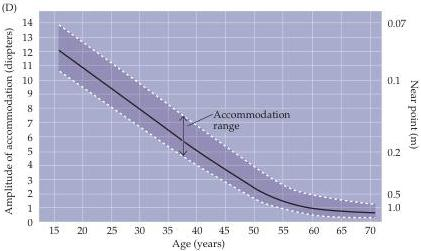

Vision: The Eye 233

(D) Changes in the ability of the lens to round up (accommodate) with age.
The graph also shows how the near point (the closest point to the eye that can be brought into focus) changes.
Accommodation, which is an optical measurement of the refractive power of the lens, is given in diopters.
(After Westheimer, 1974.)

course, most people would probably choose wearing glasses or contacts or having corneal surgery rather than indulging in the onerous daily practice that would presumably be required.
Not everyone agrees, however, that such a remedy would be effective, and a number of investigators (and drug companies) are exploring the possibility of pharmacological intervention during the period of childhood when abnormal eye growth is presumed to occur.
In any event, it is a remarkable fact that deprivation of focused light on the retina causes a compensatory growth of the eye and that this feedback loop is so easily perturbed.

Even people with normal (emmetropic) vision as young adults eventually experience difficulty focusing on near objects.
One of the many consequences of aging is that the lens loses its elasticity; as a result, the maximum curvature the lens can achieve when the ciliary muscle contracts is gradually reduced.
The near point (the closest point that can be brought into clear focus) thus recedes, and objects (such as this book) must be farther and farther away from the eye in order to focus them on the retina.
At some point, usually during

early middle age, the accommodative ability of the eye is so reduced that near vision tasks like reading become difficult or impossible (Figure D).
This condition is referred to as presbyopia, and can be corrected by convex lenses for near-vision tasks, or by bifocal lenses if myopia is also present (which requires a negative correction).
Bifocal correction presents a particular problem for those who prefer contact lenses.
Because contact lenses float on the surface of the cornea, having the distance correction above and the near correction below (as in conventional bifocal glasses) doesn't work (although "omnifocal" contact lenses have recently been used with some success).
A surprisingly effective solution to this problem for some contact lens wearers has been to put a near correcting lens in one eye and a distance correcting lens in the other! The success of this approach is another

testament to the remarkable ability of the visual system to adjust to a wide variety of unusual demands.

# References

BOCK, G.
AND K.
WIDDOWS (1990) Myopia and the Control of Eye Growth.
Ciba Foundation Symposium 155.
Chichester: Wiley.
COSTER, D.
J.
(1994) Physics for Ophthalmologists.
Edinburgh: Churchill Livingston.
KAUFMAN, P.
L.
AND A.
ALM (EDS.) (2002) Adler's Physiology of the Eye: Clinical Application, 10th Ed.
St.
Louis, MO: Mosby Year Book.
SHERMAN, S.
M., T.
T.
NORTON AND V.
A.
CASAGRANDE (1977) Myopia in the lidsutured tree shrew.
Brain Res.
124: 154-157.
WALLMAN, J., J.
TURKEL AND J.
TRACTMAN (1978) Extreme myopia produced by modest changes in early visual experience.
Science 201: 1249-1251.
WIESEL, T.
N.
AND E.
RAVIOLA (1977) Myopia and eye enlargement after neonatal lid fusion in monkeys.
Nature 266: 66-68.

reducing the tension on the lens.
Unfortunately, changes in the shape of the lens are not always able to produce a focused image on the retina, in which case a sharp image can be focused only with the help of additional corrective lenses (see Box A).

Adjustments in the size of the pupil also contribute to the clarity of images formed on the retina.
Like the images formed by other optical instruments, those generated by the eye are affected by spherical and chromatic aberrations, which tend to blur the retinal image.
Since these aberrations are greatest for light rays that pass farthest from the center of the lens, narrow-