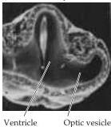
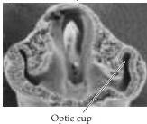
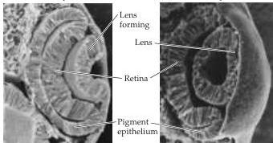

Chapter Ten

ing the pupil reduces both spherical and chromatic aberration, just as closing the iris diaphragm on a camera lens improves the sharpness of a photographic image.
Reducing the size of the pupil also increases the depth of field—that is, the distance within which objects are seen without blurring.
However, a small pupil also limits the amount of light that reaches the retina, and, under conditions of dim illumination, visual acuity becomes limited by the number of available photons rather than by optical aberrations.
An adjustable pupil thus provides an effective means of reducing optical aberrations, while maximizing depth of field to the extent that different levels of illumination permit.
The size of the pupil is controlled by innervation from both sympathetic and parasympathetic divisions of the visceral motor system, which are in turn modulated by several brainstem centers (see Chapters 19 and 20).

## The Retina

Despite its peripheral location, the retina or neural portion of the eye, is actually part of the central nervous system.
During development, the retina forms as an outpocketing of the diencephalon, called the optic vesicle, which undergoes invagination to form the optic cup (Figure 10.3; see also Chapter 21).
The inner wall of the optic cup gives rise to the retina, while the outer wall gives rise to the retinal pigment epithelium.
This epithelium is a thin melanin-containing structure that reduces backscattering of light that enters the eye; it also plays a critical role in the maintenance of photoreceptors, renewing photopigments and phagocytosing the photoreceptor disks, whose turnover at a high rate is essential to vision.

Consistent with its status as a full-fledged part of the central nervous system, the retina comprises complex neural circuitry that converts the graded electrical activity of photoreceptors into action potentials that travel to the brain via axons in the optic nerve.
Although it has the same types of functional elements and neurotransmitters found in other parts of the central nervous system, the retina comprises fewer classes of neurons, and these are arranged in a manner that has been less difficult to unravel than the circuits in other areas of the brain.
There are five types of neurons in the retina: photoreceptors, bipolar cells, ganglion cells, horizontal cells, and amacrine cells.
The cell bodies and processes of these neurons are stacked in alternating layers, with the cell bodies located in the inner nuclear, outer nuclear, and ganglion cell layers, and the processes and synaptic contacts located in the inner plexiform and outer plexiform layers (Figure 10.4).
A direct three-

(A) 4-mm embryo

(B) 4.5-mm embryo

(C) 5-mm embryo