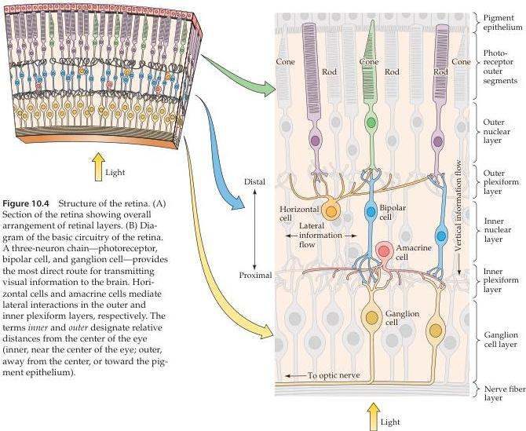

Vision: The Eye

(A) Section of retina
(B)

neuron chain—photoreceptor cell to bipolar cell to ganglion cell—is the major route of information flow from photoreceptors to the optic nerve.

There are two types of photoreceptors in the retina: rods and cones.
Both types have an outer segment composed of membranous disks that contain light-sensitive photopigment and lies adjacent to the pigment epithelium, and an inner segment that contains the cell nucleus and gives rise to synaptic terminals that contact bipolar or horizontal cells (see also Figure 10.8).
Absorption of light by the photopigment in the outer segment of the photoreceptors initiates a cascade of events that changes the membrane potential of the receptor, and therefore the amount of neurotransmitter released by the photoreceptor synapses onto the cells they contact.
The synapses between photoreceptor terminals and bipolar cells (and horizontal cells) occur in the outer plexiform layer; more specifically, the cell bodies of photoreceptors make up the outer nuclear layer, whereas the cell bodies of bipolar cells lie in the inner nuclear layer.
The short axonal processes of bipolar cells make synaptic contacts in turn on the dendritic processes of ganglion cells in the inner plexiform layer.
The much larger axons of the ganglion cells form the optic