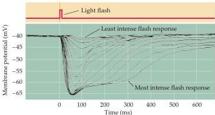

Vision: The Eye

Figure 10.5 An intracellular recording from a single cone stimulated with different amounts of light (the cone has been taken from the turtle retina, which accounts for the relatively long time course of the response).
Each trace represents the response to a brief flash that was varied in intensity.
At the highest light levels, the response amplitude saturates (at about  $-65\mathrm{mV}$ ).
The hyperpolarizing response is characteristic of vertebrate photoreceptors; interestingly, some invertebrate photoreceptors depolarize in response to light.
(After Schnapf and Baylor, 1987.)

much of the processing within the retina is mediated by graded potentials, largely because action potentials are not required to transmit information over the relatively short distances involved.

Perhaps even more surprising is that shining light on a photoreceptor, either a rod or a cone, leads to membrane hyperpolarization rather than depolarization (Figure 10.5).
In the dark, the receptor is in a depolarized state, with a membrane potential of roughly  $-40\mathrm{mV}$  (including those portions of the cell that release transmitters).
Progressive increases in the intensity of illumination cause the potential across the receptor membrane to become more negative, a response that saturates when the membrane potential reaches about  $-65\mathrm{mV}$ .
Although the sign of the potential change may seem odd, the only logical requirement for subsequent visual processing is a consistent relationship between luminance changes and the rate of transmitter release from the photoreceptor terminals.
As in other nerve cells, transmitter release from the synaptic terminals of the photoreceptor is dependent on voltage-sensitive  $\mathrm{Ca^{2+}}$  channels in the terminal membrane.
Thus, in the dark, when photoreceptors are relatively depolarized, the number of open  $\mathrm{Ca^{2+}}$  channels in the synaptic terminal is high, and the rate of transmitter release is correspondingly great; in the light, when receptors are hyperpolarized, the number of open  $\mathrm{Ca^{2+}}$  channels is reduced, and the rate of transmitter release is also reduced.
The reason for this unusual arrangement compared to other sensory receptor cells is not known.

The relatively depolarized state of photoreceptors in the dark depends on the presence of ion channels in the outer segment membrane that permit  $\mathrm{Na^{+}}$  and  $\mathrm{Ca^{2 + }}$  ions to flow into the cell, thus reducing the degree of inside negativity (Figure 10.6).
The probability of these channels in the outer segment being open or closed is regulated in turn by the levels of the nucleotide cyclic guanosine monophosphate (cGMP) (as in many other second messenger systems; see Chapter 7).
In darkness, high levels of cGMP in the outer segment keep the channels open.
In the light, however, cGMP levels drop and some of the channels close, leading to hyperpolarization of the outer segment membrane, and ultimately the reduction of transmitter release at the photoreceptor synapse.

The series of biochemical changes that ultimately leads to a reduction in cGMP levels begins when a photon is absorbed by the photopigment in the receptor disks.
The photopigment contains a light-absorbing chromophore (retinal, an aldehyde of vitamin A) coupled to one of several possible proteins called opsins that tune the molecule's absorption of light to a particular region of the spectrum.
Indeed, it is the different protein component of