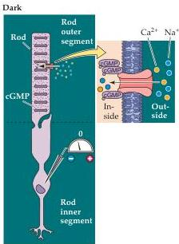
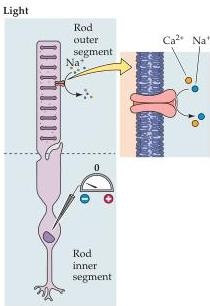
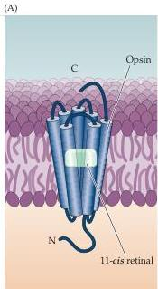
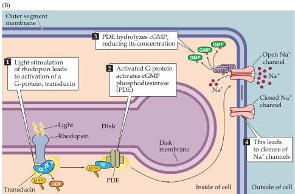

Chapter Ten

Figure 10.6 Cyclic GMP-gated channels in the outer segment membrane are responsible for the light-induced changes in the electrical activity of photoreceptors (a rod is shown here, but the same scheme applies to cones).
In the dark, cGMP levels in the outer segment are high; this molecule binds to the  $\mathrm{Na^{+}}$ -permeable channels in the membrane, keeping them open and allowing sodium (and other cations) to enter, thus depolarizing the cell.
Exposure to light leads to a decrease in cGMP levels, a closing of the channels, and receptor hyperpolarization.

Figure 10.7 Details of phototransduction in rod photoreceptors.
(A) The molecular structure of rhodopsin, the pigment in rods.
(B) The second messenger cascade of phototransduction.
Light stimulation of rhodopsin in the receptor disks leads to the activation of a G-protein (transducin), which in turn activates a phosphodiesterase (PDE).
The phosphodiesterase hydrolyzes cGMP, reducing its concentration in the outer segment and leading to the closure of sodium channels in the outer segment membrane.

the photopigment in rods and cones that contributes to the functional specialization of these two receptor types.
Most of what is known about the molecular events of phototransduction has been gleaned from experiments in rods, in which the photopigment is rhodopsin (Figure 10.7A).
When the retinal moiety in the rhodopsin molecule absorbs a photon, its configuration changes from the 11-cis isomer to all-trans retinal; this change then triggers a series of alterations in the protein component of the molecule (Figure 10.7B).
The changes lead, in turn, to the activation of an intracellular messenger called transducin, which activates a phosphodiesterase that hydrolyzes