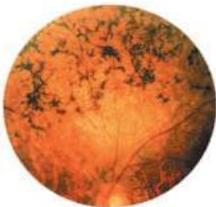

Vision: The Eye 239

# Box B

## Retinitis Pigmentosa

Retinitis pigmentosa (RP) refers to a heterogeneous group of hereditary eye disorders characterized by progressive vision loss due to a gradual degeneration of photoreceptors.
An estimated 100,000 people in the United States have RP.
In spite of the name, inflammation is not a prominent part of the disease process; instead the photoreceptor cells appear to die by apoptosis (determined by the presence of DNA fragmentation).

Classification of this group of disorders under one rubric is based on the clinical features commonly observed in these patients.
The hallmarks of RP are night blindness, a reduction of peripheral vision, narrowing of the retinal vessels, and the migration of pigment from disrupted retinal pigment epithelium into the retina, forming clumps of various sizes, often next to retinal blood vessels (see figure).

Typically, patients first notice difficulty seeing at night due to the loss of rod photoreceptors; the remaining cone

Characteristic appearance of the retina in patients with retinitis pigmentosa.
Note the dark clumps of pigment that are the hallmark of this disorder.

photoreceptors then become the mainstay of visual function.
Over many years, the cones also degenerate, leading to a progressive loss of vision.
In most RP patients, visual field defects begin in the midperiphery, between 30° and 50° from the point of foveal fixation.
The defective regions gradually enlarge, leaving islands of vision in the periphery and a constricted central field—a condition known as tunnel vision.
When the visual field contracts to 20° or less and/or central vision is 20/200 or worse, the patient is categorized as legally blind.

Inheritance patterns indicate that RP can be transmitted in an X-linked (XLRP), autosomal dominant (ADRP), or recessive (ARRP) manner.
In the United States, the percentage of these genetic types is estimated to be 9%, 16%, and 41%, respectively.
When only one member of a pedigree has RP, the case is classified as "simplex," which accounts for about a third of all cases.

Among the three genetic types of RP, ADRP is the mildest.
These patients often retain good central vision until 60 years of age or older.
In contrast, patients with the XLRP form of the disease are usually legally blind by 30 to 40 years of age.
However, the severity and age of onset of the symptoms varies greatly among patients with the same type of RP, and even within the same family (when, presumably, all the affected members have the same genetic mutation).

To date, RP-inducing mutations of 30 genes have been identified.
Many of these genes encode photoreceptor-specific proteins, several being associated with phototransduction in the rods.
Among the latter are genes for rhodopsin, subunits of the cGMP phosphodiesterase, and the cGMP-gated channel.
Multiple mutations have been found in each of these cloned genes.
For example, in the case of the rhodopsin gene, 90 different mutations have been identified among ADRP patients.

The heterogeneity of RP at all levels, from genetic mutations to clinical symptoms, has important implications for understanding the pathogenesis of the disease and designing therapies.
Given the complex molecular etiology of RP, it is unlikely that a single cellular mechanism will explain the disease in all cases.
Regardless of the specific mutation or causal sequence, the vision loss that is most critical to RP patients is due to the gradual degeneration of cones.
In many cases, the protein that the RP-causing mutation affects is not even expressed in the cones; the prime example is rhodopsin—the rod-specific visual pigment.
Therefore, the loss of cones may be an indirect result of a rod-specific mutation.
In consequence, understanding and treating this disease presents a particularly difficult challenge.

## References

WELEBER, R.
G.
AND K.
GREGORY-EVANS (2001) Retinitis pigmentosa and allied disorders.
In Retina, 3rd Ed., Vol.
1: Basic Science and Inherited Retinal Diseases.
S.
J.
Ryan (ed.
in chief).
St.
Louis, MO: Mosby Year Book, pp.
362-460.
RATTNER, A., A.
SUN AND J.
NATHANS (1999) Molecular genetics of human retinal disease.
Annu.
Rev.
Genet.
33: 89-131.
THE FOUNDATION FIGHTING BLINDNESS of Hunt Valley, MD, maintains a web site that provides updated information about many forms of retinal degeneration: www.blindness.org
RETNET provides updated information, including references to original articles, on genes and mutations associated with retinal diseases: www.sph.uth.tmc.edu/RetNet