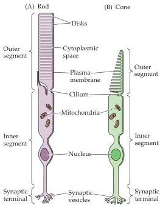

Vision: The Eye

Figure 10.8 Structural differences between rods and cones.
Although generally similar in structure, rods (A) and cones (B) differ in their size and shape, as well as in the arrangement of the membranous disks in their outer segments.

tain, distribution across the retina, and pattern of synaptic connections (Figure 10.8).
These properties reflect the fact that the rod and cone systems (the receptors and their connections within the retina) are specialized for different aspects of vision.
The rod system has very low spatial resolution but is extremely sensitive to light; it is therefore specialized for sensitivity at the expense of resolution.
Conversely, the cone system has very high spatial resolution but is relatively insensitive to light; it is therefore specialized for acuity at the expense of sensitivity.
The properties of the cone system also allow humans and many other animals to see color.

The range of illumination over which the rods and cones operate is shown in Figure 10.9.
At the lowest levels of light, only the rods are activated.
Such rod-mediated perception is called scotopic vision.
The difficulty of making fine visual discriminations under very low light conditions where only the rod system is active is a common experience.
The problem is primarily the poor resolution of the rod system (and, to a lesser degree, the fact that there is no perception of color in dim light because the cones are not involved to a significant degree).
Although cones begin to contribute to visual perception at about the level of starlight, spatial discrimination at this light level is still very poor.
As illumination increases, cones become more and more dominant in determining what is seen, and they are the major determinant of perception under relatively bright conditions such as normal indoor lighting or sunlight.
The contributions of rods to vision drops out nearly entirely in so-called photopic vision because their response to light saturates—that is, the membrane potential of individual rods no longer varies as a function of illumination because all of the membrane channels are closed (see Figure 10.5).
Mesopic vision occurs in levels of light at which both rods and cones contribute—at twilight, for example.
From these considerations it should be clear that most of what we think of as normal "seeing" is mediated by the cone system, and that loss of cone function is devastating, as occurs in