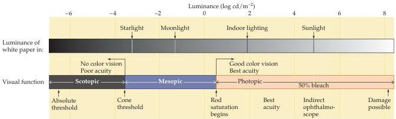

Chapter Ten

Figure 10.9 The range of luminance values over which the visual system operates.
At the lowest levels of illumination, only rods are activated.
Cones begin to contribute to perception at about the level of starlight and are the only receptors that function under relatively bright conditions.

elderly individuals suffering from macular degeneration (Box C).
People who have lost cone function are legally blind, whereas those who have lost rod function only experience difficulty seeing at low levels of illumination (night blindness; see Box B).

Differences in the transduction mechanisms utilized by the two receptor types is a major factor in the ability of rods and cones to respond to different ranges of light intensity.
For example, rods produce a reliable response to a single photon of light, whereas more than 100 photons are required to produce a comparable response in a cone.
It is not, however, that cones fail to effectively capture photons.
Rather, the change in current produced by single photon capture in cones is comparatively small and difficult to distinguish from noise.
Another difference is that the response of an individual cone does not saturate at high levels of steady illumination, as does the rod response.
Although both rods and cones adapt to operate over a range of luminance values, the adaptation mechanisms of the cones are more effective.
This difference in adaptation is apparent in the time course of the response of rods and cones to light flashes.
The response of a cone, even to a bright light flash that produces the maximum change in photoreceptor current, recovers in about 200 milliseconds, more than four times faster than rod recovery.

The arrangement of the circuits that transmit rod and cone information to retinal ganglion cells also contributes to the different characteristics of scotopic and photopic vision.
In most parts of the retina, rod and cone signals converge on the same ganglion cells; i.e., individual ganglion cells respond to both rod and cone inputs, depending on the level of illumination.
The early stages of the pathways that link rods and cones to ganglion cells, however, are largely independent.
For example, the pathway from rods to ganglion cells involves a distinct class of bipolar cell (called rod bipolar) that, unlike cone bipolar cells, does not contact retinal ganglion cells.
Instead, rod bipolar cells synapse with the dendritic processes of a specific class of amacrine cell that makes gap junctions and chemical synapses with the terminals of cone bipolars; these processes, in turn, make synaptic contacts on the dendrites of ganglion cells in the inner plexiform layer.
As a consequence, the circuits linking the rods and cones to retinal ganglion cells differ dramatically in their degree of convergence.
Each rod bipolar cell is contacted by a number of rods, and many rod bipolar cells contact a given amacrine cell.
In contrast, the cone system is much less convergent.
Thus, each retinal ganglion cell that dominates central vision (called midget gan