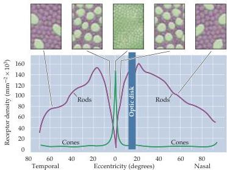

Chapter Ten

glion cells) receives input from only one cone bipolar cell, which, in turn, is contacted by a single cone.
Convergence makes the rod system a better detector of light, because small signals from many rods are pooled to generate a large response in the bipolar cell.
At the same time, convergence reduces the spatial resolution of the rod system, since the source of a signal in a rod bipolar cell or retinal ganglion cell could have come from anywhere within a relatively large area of the retinal surface.
The one-to-one relationship of cones to bipolar and ganglion cells is, of course, just what is required to maximize acuity.

## Anatomical Distribution of Rods and Cones

The distribution of rods and cones across the surface of the retina also has important consequences for vision (Figure 10.10).
Despite the fact that perception in typical daytime light levels is dominated by cone-mediated vision, the total number of rods in the human retina (about 90 million) far exceeds the number of cones (roughly 4.5 million).
As a result, the density of rods is much greater than cones throughout most of the retina.
However, this relationship changes dramatically in the fovea, a highly specialized region of the central retina that measures about 1.2 millimeters in diameter (Figure 10.11).
In the fovea, cone density increases almost 200-fold, reaching, at its center, the highest receptor packing density anywhere in the retina.
This high density is achieved by decreasing the diameter of the cone outer segments such that foveal cones resemble rods in their appearance.
The increased density of cones in the fovea is accompanied by a sharp decline in the density of rods.
In fact, the central $300\mu \mathrm{m}$ of the fovea, called the foveola, is totally rod-free.

The extremely high density of cone receptors in the fovea, and the one-to-one relationship with bipolar cells and retinal ganglion cells (see earlier), endows this component of the cone system with the capacity to mediate high visual acuity.
As cone density declines with eccentricity and the degree of convergence onto retinal ganglion cells increases, acuity is markedly reduced.
Just $6^{\circ}$ eccentric to the line of sight, acuity is reduced by $75\%$, a fact

Figure 10.10 Distribution of rods and cones in the human retina.
Graph illustrates that cones are present at a low density throughout the retina, with a sharp peak in the center of the fovea.
Conversely, rods are present at high density throughout most of the retina, with a sharp decline in the fovea.
Boxes at top illustrate the appearance of face on sections through the outer segments of the photoreceptors at different eccentricities.
The increased density of cones in the fovea is accompanied by a striking reduction in the diameter of their outer segments.