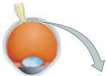
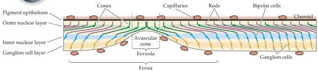

Vision: The Eye

Figure 10.11 Diagrammatic cross section through the human fovea.
The overlying cellular layers and blood vessels are displaced so that light is subjected to a minimum of scattering before photons strike the outer segments of the cones in the center of the fovea, called the foveola.

that can be readily appreciated by trying to read the words on any line of this page beyond the word being fixated on.
The restriction of highest acuity vision to such a small region of the retina is the main reason humans spend so much time moving their eyes (and heads) around—in effect directing the foveas of the two eyes to objects of interest (see Chapter 19).
It is also the reason why disorders that affect the functioning of the fovea have such devastating effects on sight (see Box C).
Conversely, the exclusion of rods from the fovea, and their presence in high density away from the fovea, explain why the threshold for detecting a light stimulus is lower outside the region of central vision.
It is easier to see a dim object (such as a faint star) by looking slightly away from it, so that the stimulus falls on the region of the retina that is richest in rods (see Figure 10.10).

Another anatomical feature of the fovea (which literally means "pit") that contributes to the superior acuity of the cone system is that the layers of cell bodies and processes that overlie the photoreceptors in other areas of the retina are displaced around the fovea, and especially the foveola (see Figure 10.11).
As a result, photons are subjected to a minimum of scattering before they strike the photoreceptors.
Finally, another potential source of optical distortion that lies in the light path to the receptors—the retinal blood vessels—are diverted away from the foveola.
This central region of the fovea is therefore dependent on the underlying choroid and pigment epithelium for oxygenation and metabolic sustenance.

# Cones and Color Vision

A special property of the cone system is color vision.
Perceiving color allows humans (and many other animals) to discriminate objects on the basis of the distribution of the wavelengths of light that they reflect to the eye.
While differences in luminance (i.e., overall light intensity) are often sufficient to distinguish objects, color adds another perceptual dimension that is especially useful when differences in luminance are subtle or nonexistent.
Color obviously gives us a quite different way of perceiving and describing the world we live in.