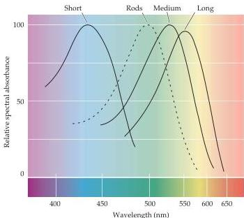

Chapter Ten

Unlike rods, which contain a single photopigment, there are three types of cones that differ in the photopigment they contain.
Each of these photopigments has a different sensitivity to light of different wavelengths, and for this reason are referred to as "blue," "green," and "red" or, more appropriately, short (S), medium (M), and long (L) wavelength cones—terms that more or less describe their spectral sensitivities (Figure 10.12).
This nomenclature implies that individual cones provide color information for the wavelength of light that excites them best.
In fact, individual cones, like rods, are entirely color blind in that their response is simply a reflection of the number of photons they capture, regardless of the wavelength of the photon (or, more properly, its vibrational energy).
It is impossible, therefore, to determine whether the change in the membrane potential of a particular cone has arisen from exposure to many photons at wavelengths to which the receptor is relatively insensitive, or fewer photons at wavelengths to which it is most sensitive.
This ambiguity can only be resolved by comparing the activity in different classes of cones.
Based on the responses of individual ganglion cells, and cells at higher levels in the visual pathway (see Chapter 11), comparisons of this type are clearly involved in how the visual system extracts color information from spectral stimuli.
Despite these insights, a full understanding of the neural mechanisms that underlie color perception has been elusive (Box D).

Much additional information about color vision has come from studies of individuals with abnormal color detecting abilities.
Color vision deficiencies result either from the inherited failure to make one or more of the cone pigments or from an alteration in the absorption spectra of cone pigments (or, rarely, from lesions in the central stations that process color information; see Chapter 11).
Under normal conditions, most people can match any color in a test stimulus by adjusting the intensity of three superimposed light sources generating long, medium, and short wavelengths.
The fact that only three such sources are needed to match (nearly) all the perceived colors is strong

Figure 10.12 Color vision.
The light absorption spectra of the four photopigments in the normal human retina.
(Recall that light is defined as electromagnetic radiation having wavelengths between  $\sim 400$  and  $700\mathrm{nm}$ .) The solid curves indicate the three kinds of cone opsins; the dashed curve shows rod rhodopsin for comparison.
Absorbance is defined as the log value of the intensity of incident light divided by intensity of transmitted light.