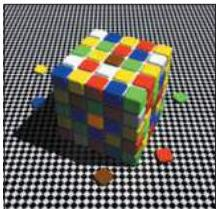
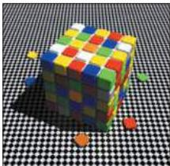
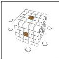
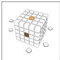

Vision: The Eye 247

# Box D

## The Importance of Context in Color Perception

Seeing color logically demands that retinal responses to different wavelengths in some way be compared.
The discovery of the three human cone types and their different absorption spectra is correctly regarded, therefore, as the basis for human color vision.
Nevertheless, how these human cone types and the higher-order neurons they contact (see Chapter 11) produce the sensations of color is still unclear.
Indeed, this issue has been debated by some of the greatest minds in science (Hering, Helmholtz, Maxwell, Schroedinger, and Mach, to name only a few) since Thomas Young first proposed that humans must have three different receptive "particles"—i.e., the three cone types.

A fundamental problem has been that, although the relative activities of three cone types can more or less explain the colors perceived in color-matching experiments performed in the laboratory, the perception of color is strongly influenced by context.
For example, a patch returning the exact same spectrum of wavelengths to the eye can appear quite different depending on its surround, a phenomenon called color contrast (Figure A).
Moreover, test patches returning different spectra to the eye can appear to be the same color, an effect called color constancy (Figure B).
Although these phenomena were well known in the nineteenth century, they were not accorded a central place in color vision theory until Edwin Land's work in the 1950s.
In his most famous demonstration, Land (who among other achievements founded the Polaroid company and became a billionaire) used a collage of colored papers that have been referred to as "the Land Mondrians" because of their similarity to the work of the Dutch artist Piet Mondrian.

Using a telemetric photometer and three adjustable illuminators generating short, middle, and long wavelength light, Land showed that two patches that in white light appeared quite different in color (e.
g., green and brown) continued to look their respective colors even when the three illuminators were adjusted so that the light being returned from the "green" surfaces produced exactly the same readings on the three telephotometers as had previously come from the "brown" surface—a striking demonstration of color constancy.

The phenomena of color contrast and color constancy have led to a heated modern debate about how color percepts are generated that now spans several decades.
For Land, the answer lay in a series of ratiometric equations that could integrate the spectral returns of different regions over the entire scene.
It was recognized even before Land's death in 1991, however, that his so-called retinex theory did not work in all circumstances and was in any event a description rather than an explanation.
An alternative explanation of these contextual aspects of color vision is that color, like brightness, is generated empirically according to what spectral stimuli have typically signified in past experience (see Box E).

## References

LAND, E.
(1986) Recent advances in Retinex theory.
Vis.
Res.
26: 7-21.

PURVES, D.
AND R.
B.
LOTTO (2003) Why We See What We Do: An Empirical Theory of Vision, Chapters 5 and 6.
Sunderland MA: Sinauer Associates, pp.
89-138.

(A)

(B)

The genesis of contrast and constancy effects by exactly the same context.
The two panels demonstrate the effects on apparent color when two similarly reflective target surfaces (A) or two differently reflective target surfaces (B) are presented in the same context in which all the information provided is consistent with illumination that differs only in intensity.
The appearances of the relevant target surfaces in a neutral context are shown in the insets below.
(From Purves and Lotto, 2003)

