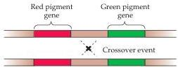
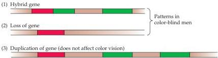

Chapter Ten

confirmation of the fact that color sensation is based on the relative levels of activity in three sets of cones with different absorption spectra.
That color vision is trichromatic was first recognized by Thomas Young at the beginning of the nineteenth century (thus, people with normal color vision are called trichromats).
For about 5–6% of the male population in the United States and a much smaller percentage of the female population, however, color vision is more limited.
Only two bandwidths of light are needed to match all the colors that these individuals can perceive; the third color category is simply not seen.
Such dichromacy, or “color blindness” as it is commonly called, is inherited as a recessive, sex-linked characteristic and exists in two forms: protanopia, in which all color matches can be achieved by using only green and blue light, and deuteranopia, in which all matches can be achieved by using only blue and red light.
In another major class of color deficiencies, all three light sources (i.e., short, medium, and long wavelengths) are needed to make all possible color matches, but the matches are made using values that are significantly different from those used by most individuals.
Some of these anomalous trichromats require more red than normal to match other colors (protanomalous trichromats); others require more green than normal (deuteranomalous trichromats).

Jeremy Nathans and his colleagues at Johns Hopkins University have provided a deeper understanding of these color vision deficiencies by identifying and sequencing the genes that encode the three human cone pigments (Figure 10.13).
The genes that encode the red and green pigments show a high degree of sequence homology and lie adjacent to each other on the X chromosome, thus explaining the prevalence of color blindness in males.
In contrast, the blue-sensitive pigment gene is found on chromosome 7 and is quite different in its amino acid sequence.
These facts suggest that the red and green pigment genes evolved relatively recently, perhaps as a result of the duplication of a single ancestral gene; they also explain why most color vision abnormalities involve the red and green cone pigments.

Human dichromats lack one of the three cone pigments, either because the corresponding gene is missing or because it exists as a hybrid of the red and green pigment genes (see Figure 10.13).
For example, some dichromats lack the green pigment gene altogether, while others have a hybrid gene that is thought to produce a red-like pigment in the “green” cones.
Anomalous trichromats also possess hybrid genes, but these genes elaborate pigments

Figure 10.13 Many deficiencies of color vision are the result of genetic alterations in the red or green cone pigments due to the crossing over of chromosomes during meiosis.
This recombination can lead to the loss of a gene, the duplication of a gene, or the formation of a hybrid with characteristics distinct from those of normal genes.

Different crossover events can lead to:

