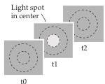
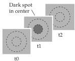
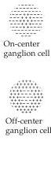
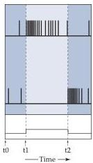
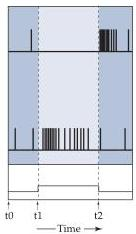
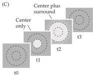
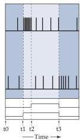

Vision: The Eye 249

whose spectral properties lie between those of the normal red and green pigments.
Thus, although most anomalous trichromats have distinct sets of medium and long-wavelength cones, there is more overlap in their absorption spectra than in normal trichromats, and thus less difference in how the two sets of cones respond to a given wavelength (with resulting anomalies in color perception).

## Retinal Circuits for Detecting Luminance Change

Despite the esthetically pleasing nature of color vision, most of the information in visual scenes consists of spatial variations in light intensity (a black and white movie, for example, has most of the information a color version has, although it is deficient in some respects and usually is less fun to watch).
How the spatial patterns of light and dark that fall on the photoreceptors are deciphered by central targets has been a vexing problem (Box E).
To understand what is accomplished by the complex neural circuits within the retina during this process, it is useful to start by considering the responses of individual retinal ganglion cells to small spots of light.
Stephen Kuffler, working at Johns Hopkins University in the 1950s, pioneered this approach by characterizing the responses of single ganglion cells in the cat retina.
He found that each ganglion cell responds to stimulation of a small circular patch of the retina, which defines the cell's receptive field (see Chapter 8 for discussion of receptive fields).
Based on these responses, Kuffler distinguished two classes of ganglion cells, "on"-center and "off"-center (Figure 10.14).

Turning on a spot of light in the receptive field center of an on-center ganglion cell produces a burst of action potentials.
The same stimulus applied to the receptive field center of an off-center ganglion cell reduces the rate of

(A)

(B)

Figure 10.14 The responses of on-center and off-center retinal ganglion cells to stimulation of different regions of their receptive fields.
Upper panels indicate the time sequence of stimulus changes.
(A) Effects of light spot in the receptive field center.
(B) Effects of dark spot in the receptive field center.
(C) Effects of light spot in the center followed by the addition of light in the surround.

