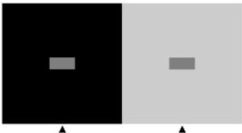
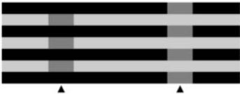
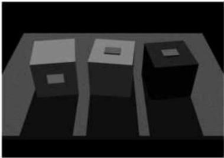

Chapter Ten

# Box E

## The Perception of Light Intensity

Understanding the link between retinal stimulation and what we see (perception) is arguably the central problem in vision, and the relation of luminance (a physical measurement of light intensity) and brightness (the sensation elicited by light intensity) is probably the simplest place to consider this challenge.

As indicated in the text, how we see the brightness differences (i.e., contrast) between adjacent territories with distinct luminances depends in the first instance on the relative firing rate of retinal ganglion cells, modified by lateral interactions.
However, there is a problem with the assumption that the central nervous system simply "reads out" these relative rates of ganglion cell activity to sense brightness.
The difficulty, as in perceiving color, is that the brightness of a given target is markedly affected by its context in ways that are difficult or impossible to explain in terms of the retinal output as such.
The accompanying figures, which illustrate two simultaneous brightness contrast illusions, help make this point.
In Figure A, two photometrically identical (equiluminant) gray squares appear differently bright as a function of the background in which they are presented.

A conventional interpretation of this phenomenon is that the receptive field properties illustrated in Figures 10.14 through 10.17 cause ganglion cells to fire differently depending on whether the surround of the equiluminant target is dark or light.
The demonstration in Figure B, however, undermines this explanation, since in this case the target surrounded by more dark area actually looks darker than the same target surrounded by more light area.

An alternative interpretation of luminance perception that can account for these puzzling phenomena is that brightness percepts are generated on a statistical basis as a means of contending with the inherent ambiguity of luminance (i.e., the fact that a given value of luminance can be generated by many different combinations of illumination and surface reflectance properties).
Since to be successful an observer has to respond to the real-world sources of luminance and not to light intensity as such, this ambiguity of the retinal stimulus presents a quandary.
A plausible solution to

(A)

(B)

(C)
(A) Standard illusion of simultaneous brightness contrast.
(B) Another illusion of simultaneous brightness contrast that is difficult to explain in conventional terms.
(C) Cartoons of some possible sources of the standard simultaneous brightness contrast illusion in (A).
(Courtesy of R.
Beau Lotto and Dale Purves.)