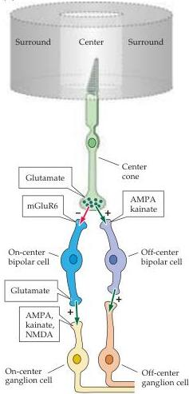
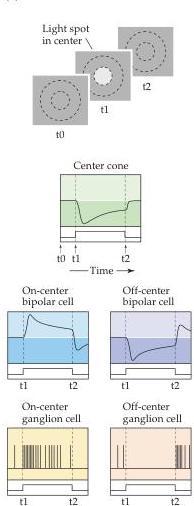
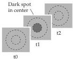
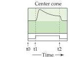
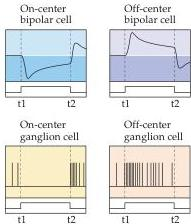

Chapter Ten

Figure 10.15 Circuitry responsible for generating receptive field center responses of retinal ganglion cells.
(A) Functional anatomy of cone inputs to the center of a ganglion cell receptive field.
A plus indicates a sign-conserving synapse; a minus represents a sign-inverting synapse.
(B) Responses of various cell types to the presentation of a light spot in the center of the ganglion cell receptive field.
(C) Responses of various cell types to the presentation of a dark spot in the center of the ganglion cell receptive field.

ties and relationships (Figure 10.15).
On- and off-center ganglion cells have dendrites that arborize in separate strata of the inner plexiform layer, forming synapses selectively with the terminals of on- and off-center bipolar cells that respond to luminance increases and decreases, respectively (Figure 10.15A).
As mentioned previously, the principal difference between ganglion cells and bipolar cells lies in the nature of their electrical response.
Like most other cells in the retina, bipolar cells have graded potentials rather than action potentials.
Graded depolarization of bipolar cells leads to an increase in transmitter release (glutamate) at their synapses and consequent depolarization of the on-center ganglion cells that they contact via AMPA, kainate, and NMDA receptors.

The selective response of on- and off-center bipolar cells to light increments and decrements is explained by the fact that they express different types of glutamate receptors (Figure 10.15A).
Off-center bipolar cells have ionotropic receptors (AMPA and kainate) that cause the cells to depolarize in response to glutamate released from photoreceptor terminals.
In contrast, on-center bipolar cells express a G-protein-coupled metabotropic glutamate receptor (mGluR6).
When bound to glutamate, these receptors activate an intracellular cascade that closes cGMP-gated  $\mathrm{Na^{+}}$  channels, reducing inward

(C)

