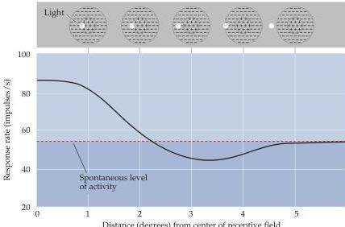

Vision: The Eye 253

current and hyperpolarizing the cell.
Thus, glutamate has opposite effects on these two classes of cells, depolarizing off-center bipolar cells and hyperpolarizing on-center cells.
Photoreceptor synapses with off-center bipolar cells are called sign-conserving, since the sign of the change in membrane potential of the bipolar cell (depolarization or hyperpolarization) is the same as that in the photoreceptor (Figure 10.15B,C).
Photoreceptor synapses with on-center bipolar cells are called sign-inverting because the change in the membrane potential of the bipolar cell is the opposite of that in the photoreceptor.

In order to understand the response of on- and off-center bipolar cells to changes in light intensity, recall that photoreceptors hyperpolarize in response to light increments, decreasing their release of neurotransmitter (Figure 10.15B).
Under these conditions, on-center bipolar cells contacted by the photoreceptors are freed from the hyperpolarizing influence of the photoreceptor's transmitter, and they depolarize.
In contrast, for off-center cells, the reduction in glutamate represents the withdrawal of a depolarizing influence, and these cells hyperpolarize.
Decrements in light intensity naturally have the opposite effect on these two classes of bipolar cells, hyperpolarizing on-center cells and depolarizing off-center ones (Figure 10.15C).

Kuffler's work also called attention to the fact that retinal ganglion cells do not act as simple photodetectors.
Indeed, most ganglion cells are relatively poor at signaling differences in the level of diffuse illumination.
Instead, they are sensitive to differences between the level of illumination that falls on the receptive field center and the level of illumination that falls on the surround—that is, to luminance contrast.
The center of a ganglion cell receptive field is surrounded by a concentric region that, when stimulated, antagonizes the response to stimulation of the receptive field center (see Figure 10.14C).
For example, as a spot of light is moved from the center of the receptive field of an on-center cell toward its periphery, the response of the cell to the spot of light decreases (Figure 10.16).
When the spot falls completely outside the center (that is, in the surround), the response of the cell falls below its resting level; the cell is effectively inhibited until the distance from the center is so great that the spot no longer falls on the receptive field at all, in which case the cell returns to its resting level of firing.
Off-center

Figure 10.16 Rate of discharge of an on-center ganglion cell to a spot of light as a function of the distance of the spot from the receptive field center.
Zero on the  $x$  axis corresponds to the center; at a distance of  $5^{\circ}$ , the spot falls outside the receptive field.