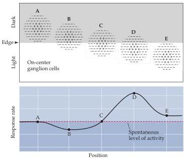

Chapter Ten

Figure 10.17 Responses of a hypothetical population of on-center ganglion cells whose receptive fields (A-E) are distributed across a light-dark edge.
Those cells whose activity is most affected have receptive fields that lie along the light-dark edge.

cells exhibit a similar surround antagonism.
Stimulation of the surround by light opposes the decrease in firing rate that occurs when the center is stimulated alone, and reduces the response to light decrements in the center (compare Figures 10.14A and 10.14C).

Because of their antagonistic surrounds, ganglion cells respond much more vigorously to small spots of light confined to their receptive field centers than to large spots, or to uniform illumination of the visual field (see Figure 10.14C).

To appreciate how center-surround antagonism makes the ganglion cell sensitive to luminance contrast, consider the activity levels in a hypothetical population of on-center ganglion cells whose receptive fields are distributed across a retinal image of a light-dark edge (Figure 10.17).
The neurons whose firing rates are most affected by this stimulus—either increased (neuron D) or decreased (neuron B)—are those with receptive fields that lie along the light-dark border; those with receptive fields completely illuminated (or completely darkened) are less affected (neurons A and E).
Thus, the information supplied by the retina to central visual stations for further processing does not give equal weight to all regions of the visual scene; rather, it emphasizes the regions where there are differences in luminance.

## Contribution of Retinal Circuits to Light Adaptation

In addition to making ganglion cells especially sensitive to light-dark borders in the visual scene, center-surround mechanisms make a significant contribution to the process of light adaptation.
As illustrated for an on-center cell in Figure 10.18, the response rate of a ganglion cell to a small spot of light turned on in its receptive field center varies as a function of the spot's intensity.
In fact, response rate is proportional to the spot's intensity over a range of about one log unit.
However, the intensity of spot illumination required to evoke a given discharge rate is dependent on the background level of illumination.
Increases in background level of illumination are accompanied by adaptive shifts in the cell's operating range such that