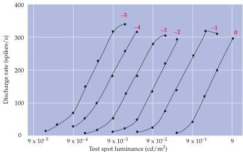

Vision: The Eye

Figure 10.18 A series of curves illustrating the discharge rate of a single on-center ganglion cell to the onset of a small test spot of light in the center of its receptive field.
Each curve represents the discharge rate evoked by spots of varying intensity at a constant background level of illumination, which is given by the red numbers at the top of each curve (the highest background level is 0, the lowest -5).
The response rate is proportional to stimulus intensity over a range of 1 log unit, but the operating range shifts to the right as the background level of illumination increases.

greater stimulus intensities are required to achieve the same discharge rate.
Thus, firing rate is not an absolute measure of light intensity, but rather signals the difference from background level of illumination.

Because the range of light intensities over which we can see is enormous compared to the narrow range of ganglion cell discharge rates (see Figure 10.9), adaptational mechanisms are essential.
By scaling the ganglion cell's response to ambient levels of illumination, the entire dynamic range of a neuron's firing rate is used to encode information about intensity differences over the range of luminance values that are relevant for a given visual scene.
Due to the antagonistic center-surround organization of retinal ganglion cells, the signal sent to the brain from the retina downplays the background level of illumination (see Figure 10.14).
This arrangement presumably explains why the relative brightness of objects remains much the same over a wide range of lighting conditions.
In bright sunlight, for example, the print on this page reflects considerably more light to the eye than it does in room light.
In fact, the print reflects more light in sunlight than the paper reflects in room light; yet it continues to look black and the page white, indoors or out.

Like the mechanism responsible for generating the on- and off-center response, the antagonistic surround of ganglion cells is a product of interactions that occur at the early stages of retinal processing (Figure 10.19).
Much of the antagonism is thought to arise via lateral connections established by horizontal cells and receptor terminals.
Horizontal cells receive synaptic inputs from photoreceptor terminals and are linked via gap junctions with a vast network of other horizontal cells distributed over a wide area of the retinal surface.
As a result, the activity in horizontal cells reflects levels of illumination over a broad area of the retina.
Although the details of their actions are not entirely clear, horizontal cells are thought to exert their influence via the release of neurotransmitter directly onto photoreceptor terminals, regulating the amount of transmitter that the photoreceptors release onto bipolar cell dendrites.

Glutamate release from photoreceptor terminals has a depolarizing effect on horizontal cells (sign-conserving synapse), while the transmitter released from horizontal cells (GABA) has a hyperpolarizing influence on photoreceptor terminals (sign-inverting synapse) (Figure 10.19A).
As a result, the net effect of inputs from the horizontal cell network is to oppose changes in the