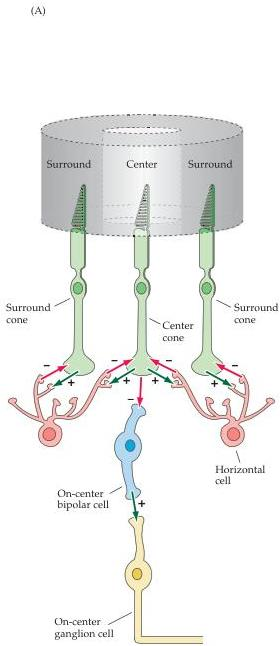
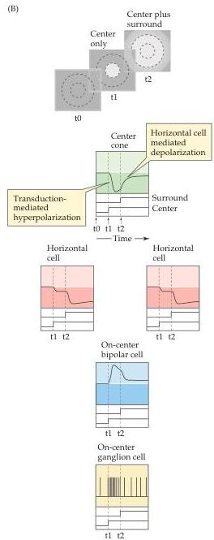

Chapter Ten

Figure 10.19 Circuitry responsible for generating the receptive field surround of an on-center retinal ganglion cell.
(A) Functional anatomy of horizontal cell inputs responsible for surround antagonism.
A plus indicates a sign-conserving synapse; a minus represents a sign-inverting synapse.
(B) Responses of various cell types to the presentation of a light spot in the center of the receptive field (t1) followed by the addition of light stimulation in the surround (t2).
Light stimulation of the surround leads to hyperpolarization of the horizontal cells and a decrease in the release of inhibitory transmitter (GABA) onto the photoreceptor terminals.
The net effect is to depolarize the center cone terminal, offsetting much of the hyperpolarization induced by the transduction cascade in the center cone's outer segment.

