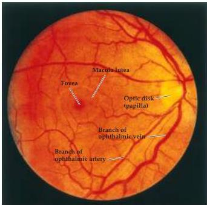

Chapter Eleven

Figure 11.1 The retinal surface of the left eye, viewed with an ophthalmoscope.
The optic disk is the region where the ganglion cell axons leave the retina to form the optic nerve; it is also characterized by the entrance and exit, respectively, of the ophthalmic arteries and veins that supply the retina.
The macula lutea can be seen as a distinct area at the center of the optical axis (the optic disk lies nasally); the macula is the region of the retina that has the highest visual acuity.
The fovea is a depression or pit about 1.5 mm in diameter that lies at the center of the macula (see Chapter 10).

side form the optic tract.
Thus, the optic tract, unlike the optic nerve, contains fibers from both eyes.
The partial crossing (or decussation) of ganglion cell axons at the optic chiasm allows information from corresponding points on the two retinas to be processed by approximately the same cortical site in each hemisphere, an important issue that is considered in the next section.

The ganglion cell axons in the optic tract reach a number of structures in the diencephalon and midbrain (Figure 11.2).
The major target in the diencephalon is the dorsal lateral geniculate nucleus of the thalamus.
Neurons in the lateral geniculate nucleus, like their counterparts in the thalamic relays of other sensory systems, send their axons to the cerebral cortex via the internal capsule.
These axons pass through a portion of the internal capsule called the optic radiation and terminate in the primary visual cortex, or striate cortex (also referred to as Brodmann's area 17 or V1), which lies largely along and within the calcarine fissure in the occipital lobe.
The retinogeniculostriate pathway, or primary visual pathway, conveys information that is essential for most of what is thought of as seeing.
Thus, damage anywhere along this route results in serious visual impairment.

A second major target of the ganglion cell axons is a collection of neurons that lies between the thalamus and the midbrain in a region known as the pretectum.
Although small in size compared to the lateral geniculate nucleus, the pretectum is particularly important as the coordinating center for the pupillary light reflex (i.e., the reduction in the diameter of the pupil that occurs when sufficient light falls on the retina) (Figure 11.3).
The initial component of the pupillary light reflex pathway is a bilateral projection from the retina to the pretectum.
Pretectal neurons, in turn, project to the Edinger-Westphal nucleus, a small group of nerve cells that lies close to the nucleus of the oculomotor nerve (cranial nerve III) in the midbrain.
The Edinger-Westphal nucleus contains the preganglionic parasympathetic neurons that send their axons via the oculomotor nerve to terminate on neurons in the ciliary