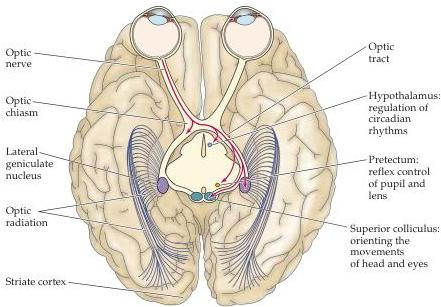
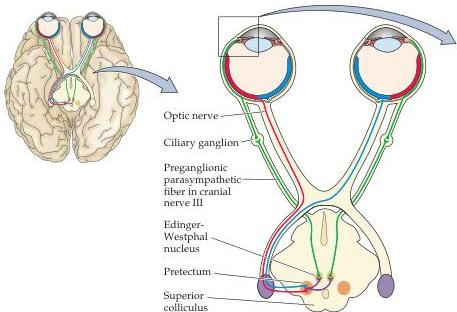
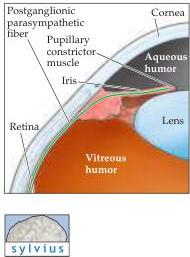

Central Visual Pathways

Figure 11.2 Central projections of retinal ganglion cells.
Ganglion cell axons terminate in the lateral geniculate nucleus of the thalamus, the superior colliculus, the pretectum, and the hypothalamus.
For clarity, only the crossing axons of the right eye are shown (view is looking up at the inferior surface of the brain).

ganglion (see Chapter 19).
Neurons in the ciliary ganglion innervate the constrictor muscle in the iris, which decreases the diameter of the pupil when activated.
Shining light in the eye thus leads to an increase in the activity of pretectal neurons, which stimulates the Edinger-Westphal neurons and the ciliary ganglion neurons they innervate, thus constricting the pupil.

In addition to its normal role in regulating the amount of light that enters the eye, the pupillary reflex provides an important diagnostic tool that allows the physician to test the integrity of the visual sensory apparatus, the motor outflow to the pupillary muscles, and the central pathways that medi

Figure 11.3 The circuitry responsible for the pupillary light reflex.
This pathway includes bilateral projections from the retina to the pretectum and projections from the pretectum to the Edinger-Westphal nucleus.
Neurons in the Edinger-Westphal nucleus terminate in the ciliary ganglion, and neurons in the ciliary ganglion innervate the pupillary constrictor muscles.
Notice that the afferent axons activate both Edinger-Westphal nuclei via the neurons in the pretectum.

