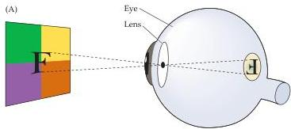
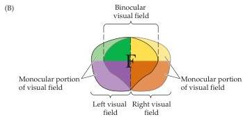
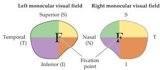
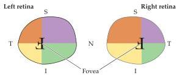

Chapter Eleven

Figure 11.4 Projection of the visual fields onto the left and right retinas.
(A) Projection of an image onto the surface of the retina.
The passage of light rays through the pupil of the eye results in images that are inverted and left-right reversed on the retinal surface.
(B) Retinal quadrants and their relation to the organization of monocular and binocular visual fields, as viewed from the back surface of the eyes.
Vertical and horizontal lines drawn through the center of the fovea define retinal quadrants (bottom).
Comparable lines drawn through the point of fixation define visual field quadrants (center).
Color coding illustrates corresponding retinal and visual field quadrants.
The overlap of the two monocular visual fields is shown at the top.

ual points in space.
As a general rule, information from the left half of the visual world, whether it originates from the left or right eye, is represented in the right half of the brain, and vice versa.

Understanding the neural basis for the appropriate arrangement of inputs from the two eyes requires considering how images are projected onto the two retinas, and the central destination of the ganglion cells located in different parts of the retina.
Each eye sees a part of visual space that defines its visual field (Figure 11.4A).
For descriptive purposes, each retina and its corresponding visual field are divided into quadrants.
In this scheme, the surface of the retina is subdivided by vertical and horizontal lines that intersect at the center of the fovea (Figure 11.4B).
The vertical line divides the retina into nasal and temporal divisions and the horizontal line divides the retina