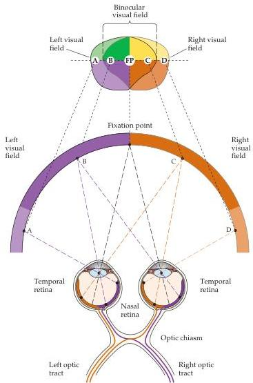

Central Visual Pathways 265

into superior and inferior divisions.
Corresponding vertical and horizontal lines in visual space (also called meridians) intersect at the point of fixation (the point in visual space that falls on the fovea) and define the quadrants of the visual field.
The crossing of light rays diverging from different points on an object at the pupil causes the images of objects in the visual field to be inverted and left-right reversed on the retinal surface.
As a result, objects in the temporal part of the visual field are seen by the nasal part of the retina, and objects in the superior part of the visual field are seen by the inferior part of the retina.
(It may help in understanding Figure 11.4B to imagine that you are looking at the back surfaces of the retinas, with the corresponding visual fields projected onto them.)

With both eyes open, the two foveas are normally aligned on a single target in visual space, causing the visual fields of both eyes to overlap extensively (see Figure 11.4B and Figure 11.5).
This binocular field of view consists of two symmetrical visual hemifields (left and right).
The left binocular hemifield includes the nasal visual field of the right eye and the temporal visual field of the left eye; the right hemifield includes the temporal visual field of

Figure 11.5 Projection of the binocular field of view onto the two retinas and its relation to the crossing of fibers in the optic chiasm.
Points in the binocular portion of the left visual field (B) fall on the nasal retina of the left eye and the temporal retina of the right eye.
Points in the binocular portion of the right visual field (C) fall on the nasal retina of the right eye and the temporal retina of the left eye.
Points that lie in the monocular portions of the left and right visual fields (A and D) fall on the left and right nasal retinas, respectively.
The axons of ganglion cells in the nasal retina cross in the optic chiasm, whereas those from the temporal retina do not.
As a result, information from the left visual field is carried in the right optic tract, and information from the right visual field is carried in the left optic tract.