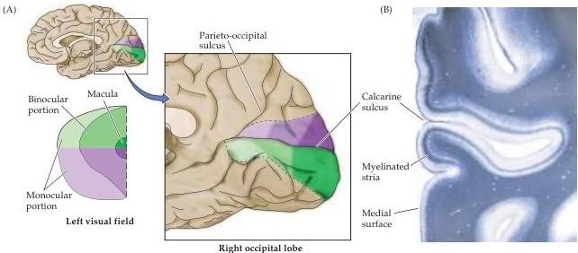

Chapter Eleven

Figure 11.6 Visuotopic organization of the striate cortex in the right occipital lobe, as seen in mid-sagittal view.
(A) The primary visual cortex occupies a large part of the occipital lobe.
The area of central vision (the fovea) is represented over a disproportionately large part of the caudal portion of the lobe, whereas peripheral vision is represented more anteriorly.
The upper visual field is represented below the calcarine sulcus, the lower field above the calcarine sulcus.
(B) Photomicrograph of a coronal section of the human striate cortex, showing the characteristic myelinated band, or stria, that gives this region of the cortex its name.
The calcarine sulcus on the medial surface of the occipital lobe is indicated.
(B courtesy of T.
Andrews and D.
Purves.)

the right eye and the nasal visual field of the left eye.
The temporal visual fields are more extensive than the nasal visual fields, reflecting the size of the nasal and temporal retinas respectively.
As a result, vision in the periphery of the field of view is strictly monocular, mediated by the most medial portion of the nasal retina.
Most of the rest of the field of view can be seen by both eyes; i.e., individual points in visual space lie in the nasal visual field of one eye and the temporal visual field of the other.
It is worth noting, however, that the shape of the face and nose impact the extent of this region of binocular vision.
In particular, the inferior nasal visual fields are less extensive than the superior nasal fields, and consequently the binocular field of view is smaller in the lower visual field than in the upper (see Figure 11.4B).

Ganglion cells that lie in the nasal division of each retina give rise to axons that cross in the chiasm, while those that lie in the temporal retina give rise to axons that remain on the same side (see Figure 11.5).
The boundary (or line of decussation) between contralaterally and ipsilaterally projecting ganglion cells runs through the center of the fovea and defines the border between the nasal and temporal hemiretinas.
Images of objects in the left visual hemifield (such as point B in Figure 11.5) fall on the nasal retina of the left eye and the temporal retina of the right eye, and the axons from ganglion cells in these regions of the two retinas project through the right optic tract.
Objects in the right visual hemifield (such as point C in Figure 11.5) fall on the nasal retina of the right eye and the temporal retina of the left eye; the axons from ganglion cells in these regions project through the left optic tract.
As mentioned previously, objects in the monocular portions of the visual hemifields (points A and D in Figure 11.5) are seen only by the most peripheral nasal retina of each eye; the axons of ganglion cells in these regions (like the rest of the nasal retina) run in the contralateral optic tract.
Thus, unlike the optic nerve, the optic tract contains the axons of ganglion cells that originate in both eyes and represent the contralateral field of view.

Optic tract axons terminate in an orderly fashion within their target structures thus generating well ordered maps of the contralateral hemifield.
For the primary visual pathway, the map of the contralateral hemifield that is established in the lateral geniculate nucleus is maintained in the projections of the lateral geniculate nucleus to the striate cortex (Figure 11.6).
Thus the

