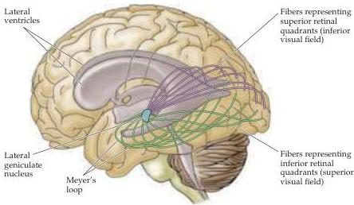

Central Visual Pathways 267

fovea is represented in the posterior part of the striate cortex, whereas the more peripheral regions of the retina are represented in progressively more anterior parts of the striate cortex.
The upper visual field is mapped below the calcarine sulcus, and the lower visual field above it.
As in the somatic sensory system, the amount of cortical area devoted to each unit area of the sensory surface is not uniform, but reflects the density of receptors and sensory axons that supply the peripheral region.
Like the representation of the hand region in the somatic sensory cortex, the representation of the macula is therefore disproportionately large, occupying most of the caudal pole of the occipital lobe.

## Visual Field Deficits

A variety of retinal or more central pathologies that involve the primary visual pathway can cause visual field deficits that are limited to particular regions of visual space.
Because the spatial relationships in the retinas are maintained in central visual structures, a careful analysis of the visual fields can often indicate the site of neurological damage.
Relatively large visual field deficits are called anopsias and smaller ones are called scotomas (see Box A).
The former term is combined with various prefixes to indicate the specific region of the visual field from which sight has been lost (Figures 11.7 and 11.8).

Damage to the retina or one of the optic nerves before it reaches the chiasm results in a loss of vision that is limited to the eye of origin.
In contrast, damage in the region of the optic chiasm—or more centrally—results in specific types of deficits that involve the visual fields of both eyes (Figure 11.8).
Damage to structures that are central to the optic chiasm, including the optic tract, lateral geniculate nucleus, optic radiation, and visual cortex, results in deficits that are limited to the contralateral visual hemifield.
For example, interruption of the optic tract on the right results in a loss of sight in the left visual field (that is, blindness in the temporal visual field of the left eye and the nasal visual field of the right eye).
Because such damage affects corresponding parts of the visual field in each eye, there is a complete loss of vision in the affected region of the binocular visual field, and the deficit is referred to as a homonymous hemianopsia (in this case, a left homonymous hemianopsia).

Figure 11.7 Course of the optic radiation to the striate cortex.
Axons carrying information about the superior portion of the visual field sweep around the lateral horn of the ventricle in the temporal lobe (Meyer's loop) before reaching the occipital lobe.
Those carrying information about the inferior portion of the visual field travel in the parietal lobe.

