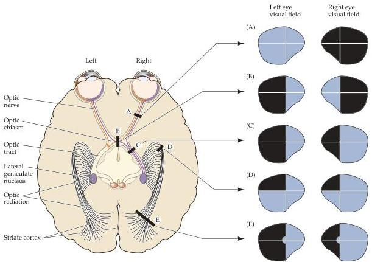

Chapter Eleven

Figure 11.8 Visual field deficits resulting from damage at different points along the primary visual pathway.
The diagram on the left illustrates the basic organization of the primary visual pathway and indicates the location of various lesions.
The right panels illustrate the visual field deficits associated with each lesion.
(A) Loss of vision in right eye.
(B) Bitemporal (heteronomous) hemianopsia.
(C) Left homonymous hemianopsia.
(D) Left superior quadrantanopsia.
(E) Left homonymous hemianopsia with macular sparing.

In contrast, damage to the optic chiasm results in visual field deficits that involve noncorresponding parts of the visual field of each eye.
For example, damage to the middle portion of the optic chiasm (which is often the result of pituitary tumors) can affect the fibers that are crossing from the nasal retina of each eye, leaving the uncrossed fibers from the temporal retinas intact.
The resulting loss of vision is confined to the temporal visual field of each eye and is known as bitemporal hemianopsia.
It is also called heteronomous hemianopsia to emphasize that the parts of the visual field that are lost in each eye do not overlap.
Individuals with this condition are able to see in both left and right visual fields, provided both eyes are open.
However, all information from the most peripheral parts of visual fields (which are seen only by the nasal retinas) is lost.

Damage to central visual structures is rarely complete.
As a result, the deficits associated with damage to the chiasm, optic tract, optic radiation, or visual cortex are typically more limited than those shown in Figure 11.8.
This is especially true for damage along the optic radiation, which fans out under the temporal and parietal lobes in its course from the lateral geniculate nucleus to the striate cortex.
Some of the optic radiation axons run out into the temporal lobe on their route to the striate cortex, a branch called Meyer's loop (see Figure 11.7).
Meyer's loop carries information from the superior portion of the contralateral visual field.
More medial parts of the optic radiation, which pass under the cortex of the parietal lobe, carry information from the inferior portion of the contralateral visual field.
Damage to parts of the temporal lobe with involvement of Meyer's loop can thus result in a superior