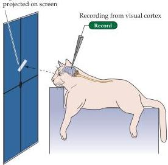
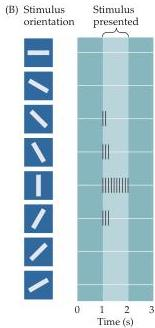

Central Visual Pathways 269

homonymous quadrantanopsia; damage to the optic radiation underlying the parietal cortex results in an inferior homonymous quadrantanopsia.

Injury to central visual structures can also lead to a phenomenon called macular sparing, i.e., the loss of vision throughout wide areas of the visual field, with the exception of foveal vision.
Macular sparing is commonly found with damage to the cortex, but can be a feature of damage anywhere along the length of the visual pathway.
Although several explanations for macular sparing have been offered, including overlap in the pattern of crossed and uncrossed ganglion cells supplying central vision, the basis for this selective preservation is not clear.

## The Functional Organization of the Striate Cortex

Much in the same way that Stephen Kuffler explored the response properties of individual retinal ganglion cells (see Chapter 10), David Hubel and Torsten Wiesel used microelectrode recordings to examine the properties of neurons in more central visual structures.

The responses of neurons in the lateral geniculate nucleus were found to be remarkably similar to those in the retina, with a center-surround receptive field organization and selectivity for luminance increases or decreases.
However, the small spots of light that were so effective at stimulating neurons in the retina and lateral geniculate nucleus were largely ineffective in visual cortex.
Instead, most cortical neurons in cats and monkeys responded vigorously to light-dark bars or edges, and only if the bars were presented at a particular range of orientations within the cell's receptive field (Figure 11.9).
The responses of cortical neurons are thus tuned to the orientation of edges, much like cone receptors are tuned to the wavelength of light; the peak in the tuning curve (the orientation to which a cell is most responsive) is referred to as the neuron's preferred orientation.
By sampling the responses of a large number of single cells, Hubel and Weisel demonstrated that all edge orientations were roughly equally represented in visual cortex.
As a

(A) Experimental setup

(B) Stimulus orientation
Stimulus presented
Figure 11.9 Neurons in the primary visual cortex respond selectively to oriented edges.
(A) An anesthetized animal is fitted with contact lenses to focus the eyes on a screen, where images can be projected; an extracellular electrode records the neuronal responses.
(B) Neurons in the primary visual cortex typically respond vigorously to a bar of light oriented at a particular angle and weakly—or not at all—to other orientations.