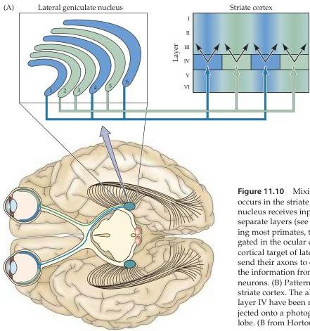
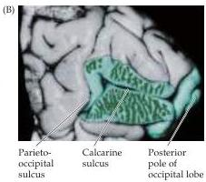

Chapter Eleven

result, a given orientation in a visual scene appears to be "encoded" in the activity of a distinct population of orientation-selective neurons.

Hubel and Wiesel also found that there are subtly different subtypes within a class of neurons that preferred the same orientation.
For example, the receptive fields of some cortical cells, which they called simple cells, were composed of spatially separate "on" and "off" response zones, as if the "on" and "off" centers of lateral geniculate cells that supplied these neurons were arrayed in separate parallel bands.
Other neurons, referred to as complex cells, exhibited mixed "on" and "off" responses throughout their receptive field, as if they received their inputs from a number of simple cells.
Further analysis uncovered cortical neurons sensitive to the length of the bar of light that was moved across their receptive field, decreasing their rate of response when the bar exceeded a certain length.
Still other cells responded selectively to the direction in which an edge moved across their receptive field.
Although the mechanisms responsible for generating these selective responses are still not well understood, there is little doubt that the specificity of the receptive field properties of neurons in the striate cortex (and beyond) plays an important role in determining the basic attributes of visual scenes.

Another feature that distinguishes the responses of neurons in the striate cortex from those at earlier stages in the primary visual pathway is binocularity.
Although the lateral geniculate nucleus receives inputs from both eyes, the axons terminate in separate layers, so that individual geniculate

Figure 11.10 Mixing of the pathways from the two eyes first occurs in the striate cortex.
(A) Although the lateral geniculate nucleus receives inputs from both eyes, these are segregated in separate layers (see also Figure 11.14).
In many species, including most primates, the inputs from the two eyes remain segregated in the ocular dominance columns of layer IV, the primary cortical target of lateral geniculate axons.
Layer IV neurons send their axons to other cortical layers; it is at this stage that the information from the two eyes converges onto individual neurons.
(B) Pattern of ocular dominance columns in human striate cortex.
The alternating left and right eye columns in layer IV have been reconstructed from tissue sections and projected onto a photograph of the medial wall of the occipital lobe.
(B from Horton and Hedley-Whyte, 1984.)

