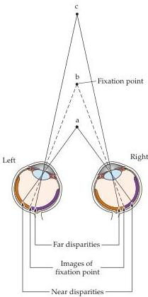

Central Visual Pathways 271

neurons are monocular, driven by either the left or right eye but not by both (Figure 11.10; see also Figure 11.14).
In some species, including most (but not all) primates, inputs from the left and right eyes remain segregated to some degree even beyond the geniculate because the axons of geniculate neurons terminate in alternating eye-specific columns within cortical layer IV—the so-called ocular dominance columns (see the next section).
Beyond this point, the signals from the two eyes are combined at the cellular level.
Thus, most cortical neurons have binocular receptive fields, and these fields are almost identical, having the same size, shape, preferred orientation, and roughly the same position in the visual field of each eye.

Bringing together the inputs from the two eyes at the level of the striate cortex provides a basis for stereopsis, the special sensation of depth that arises from viewing nearby objects with two eyes instead of one.
Because the two eyes look at the world from slightly different angles, objects that lie in front of or behind the plane of fixation project to noncorresponding points on the two retinas.
To convince yourself of this fact, hold your hand at arm's length and fixate on the tip of one finger.
Maintain fixation on the finger as you hold a pencil in your other hand about half as far away.
At this distance, the image of the pencil falls on noncorresponding points on the two retinas and will therefore be perceived as two separate pencils (a phenomenon called double vision, or diplopia).
If the pencil is now moved toward the finger (the point of fixation), the two images of the pencil fuse and a single pencil is seen in front of the finger.
Thus, for a small distance on either side of the plane of fixation, where the disparity between the two views of the world remains modest, a single image is perceived; the disparity between the two eye views of objects nearer or farther than the point of fixation is interpreted as depth (Figure 11.11).

Although the neurophysiological basis of stereopsis is not understood, some neurons in the striate cortex and in other visual cortical areas have receptive field properties that make them good candidates for extracting information about binocular disparity.
Unlike many binocular cells whose monocular receptive fields sample the same region of visual space, these neurons have monocular fields that are slightly displaced (or perhaps differ in their internal organization) so that the cell is maximally activated by stimuli that fall on noncorresponding parts of the retinas.
Some of these neurons (so-called far cells) discharge to disparities beyond the plane of fixation, while others (near cells) respond to disparities in front of the plane of fixation.
The pattern of activity in these different classes of neurons seems likely to contribute to sensations of stereoscopic depth (Box B).

Interestingly, the preservation of the binocular responses of cortical neurons is contingent on the normal activity from the two eyes during early postnatal life.
Anything that creates an imbalance in the activity of the two eyes—for example, the clouding of one lens or the abnormal alignment of the eyes during infancy (strabismus)—can permanently reduce the effectiveness of one eye in driving cortical neurons, and thus impair the ability to use binocular information as a cue for depth.
Early detection and correction of visual problems is therefore essential for normal visual function in maturity (see Chapter 23).

## The Columnar Organization of the Striate Cortex

The variety of response properties exhibited by cortical neurons raises the question of how neurons with different receptive fields are arranged within striate cortex.
For the most part, the responses of neurons are qualitatively

Figure 11.11 Binocular disparities are generally thought to be the basis of stereopsis.
When the eyes are fixated on point b, points that lie beyond the plane of fixation (point c) or in front of the point of fixation (point a) project to noncorresponding points on the two retinas.
When these disparities are small, the images are fused and the disparity is interpreted by the brain as small differences in depth.
When the disparities are greater, double vision occurs (although this normal phenomenon is generally unnoticed).