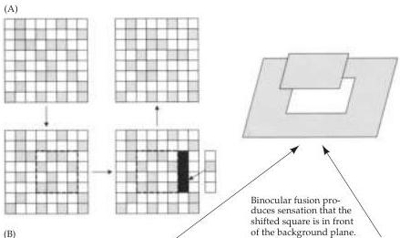
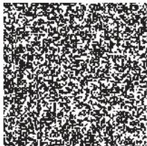
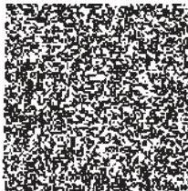

Chapter Eleven

# Box B

## Random Dot Stereograms and Related Amusements

An important advance in studies of stereopsis was made in 1959 when Bela Julesz, then working at the Bell Laboratories in Murray Hill, New Jersey, discovered an ingenious way of showing that stereoscopy depends on matching information seen by the two eyes without any prior recognition of what object(s) such matching might generate.
Julesz, a Hungarian whose background was in engineering and physics, was working on the problem of how to "break" camouflage.
He surmised that the brain's ability to fuse the slightly different views of the two eyes to bring out new information would be an aid in overcoming military camouflage.
Julesz also realized that, if his hypothesis was correct, a hidden figure in a random pattern presented to the two eyes should emerge when a portion of the otherwise identical pattern was shifted horizontally in the view of one eye or the other.
A horizontal shift in one direction would cause the hidden object to appear in front of the plane of the background, whereas a shift in the other direction would cause the hidden object to appear in back of the plane.
Such a figure, called a random dot stereogram, and the method of its creation are shown in Figures A and B.
The two images can be easily fused in a stereoscope (like the

Random dot stereograms and autostereograms.
(A) to construct a random dot stereogram, a random dot pattern is created to be observed by one eye.
The stimulus for the other eye is created by copying the first image, displacing a particular region horizontally, and then filling in the gap with a random sample of dots.
(B) When the right and left images are viewed simultaneously but independently by the two eyes (by using a stereoscope or fusing the images by converging or diverging the eyes), the shifted region (a square) appears to be in a different plane from the other dots.
(A after Wandell, 1995.)

familiar Viewmaster® toy) but can also be fused simply by allowing the eyes to diverge.
Most people find it easiest to do this by imagining that they are looking "through" the figure; after some seconds, during which the brain tries to make sense of what it is presented with, the two images merge and the hidden figure appears (in this case, a square that occupies the middle portion of the figure).
The random dot stereogram has been widely used in stereoscopic research for about 40 years, although how such stimuli elicit depth remains very much a matter of dispute.

An impressive—and extraordinarily popular—derivative of the random dot stereogram is the autostereogram (Figure C).
The possibility of autostereograms was first discerned by the nineteenth-century British physicist David Brewster.
While staring at a Victorian wallpaper with an iterated but offset pattern, he noticed that when the patterns were fused, he perceived two different planes.
The plethora of autostereograms that can be seen today in posters, books, and newspapers are close cousins of the random dot stereogram in that computers are used to shift patterns of iterated

