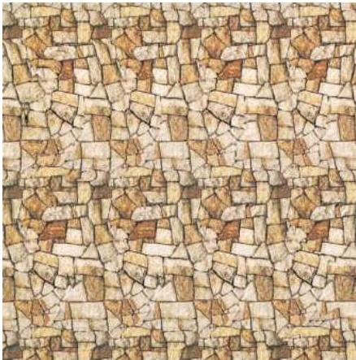

Central Visual Pathways 273

information with respect to each other.
The result is that different planes emerge from what appears to be a meaningless array of visual information (or, depending on the taste of the creator, an apparently "normal" scene in which the iterated and displaced information is hidden).
Some autostereograms are designed to reveal the hidden figure when the eyes diverge, and others when they converge.
(Looking at a plane more distant than the plane of the surface causes divergence; looking at a plane in front of the picture causes the eyes to converge; see Figure 11.11.)

The elevation of the autostereogram to a popular art form should probably be attributed to Chris W.
Tyler, a student of Julesz's and a visual psychophysicist, who was among the first to create commercial autostereograms.
Numerous graphic artists—preeminently in Japan, where the popularity of the autostereogram has been enormous—have generated many of such images.
As with the random dot stereogram, the task in viewing the autostereogram is not clear to the observer.
Nonetheless, the hidden figure emerges, often after minutes of effort in which the brain automatically tries to make sense of the occult information.

(C) An autostereogram.
The hidden figure (three geometrical forms) emerges by diverging the eyes in this case.
(C courtesy of Jun Oi.)

# References

JULESZ, B.
(1971) Foundations of Cyclopean Perception.
Chicago: The University of Chicago Press.

JULESZ, B.
(1995) Dialogues on Perception.
Cambridge, MA: MIT Press.

N.
E.
THING ENTERPRISES (1993) Magic Eye: A New Way of Looking at the World.
Kansas City: Andrews and McMeel.

similar at any one point in primary visual cortex, but tend to shift smoothly across its surface.
With respect to orientation, for example, all the neurons encountered in an electrode penetration perpendicular to the surface at a particular point will very likely have the same orientation preference, forming a "column" of cells with similar response properties.
Adjacent columns, however, usually have slightly different orientation preferences; the sequence of orientation preferences encountered along a tangential electrode penetration gradually shifts as the electrode advances (Figure 11.12).
Thus, orientation preference is mapped in the cortex, much like receptive field