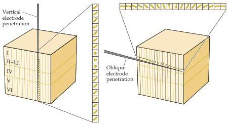

Chapter Eleven

Figure 11.12 Columnar organization of orientation selectivity in the monkey striate cortex.
Vertical electrode penetrations encounter neurons with the same preferred orientations, whereas oblique penetrations show a systematic change in orientation across the cortical surface.
The circles denote the lack of orientation-selective cells in layer IV.

location (Box C).
Unlike the map of visual space, however, the map of orientation preference is iterated many times, such that the same orientation preference is repeated at approximately 1-mm intervals across the striate cortex.
This iteration presumably ensures that there are neurons for each region of visual space that represent the full range of orientation values.
The orderly progression of orientation preference (as well as other properties that are mapped in this systematic way) is accommodated within the orderly map of visual space by the fact that the mapping is relatively coarse.
Each small region of visual space is represented by a set of neurons whose receptive fields cover the full range of orientation preferences, the set being distributed over several millimeters of the cortical surface

The columnar organization of the striate cortex is equally apparent in the binocular responses of cortical neurons.
Although most neurons in the striate cortex respond to stimulation of both eyes, the relative strength of the inputs from the two eyes varies from neuron to neuron.
At the extremes of this continuum are neurons that respond almost exclusively to the left or right eye; in the middle are those that respond equally well to both eyes.
As in the case of orientation preference, vertical electrode penetrations tend to encounter neurons with similar ocular preference (or ocular dominance, as it is usually called), whereas tangential penetrations show gradual shifts in ocular dominance.
And, like the arrangement of orientation preference, a movement of about a millimeter across the surface is required to sample the full complement of ocular dominance values (Figure 11.13).
These shifts in ocular dominance result from the ocular segregation of the inputs from lateral geniculate nucleus within cortical layer IV (see Figure 11.10).

Although the modular arrangement of the visual cortex was first recognized on the basis of these orientation and ocular dominance columns, further work has shown that other stimulus features such as color, direction of motion, and spatial frequency also tend to be distributed in iterated patterns that are systematically related to each other (for example, orientation columns tend to intersect ocular dominance columns at right angles).
In short, the striate cortex is composed of repeating units, or modules, that contain all the neuronal machinery necessary to analyze a small region of visual space for a variety of different stimulus attributes.
As described in Box D in Chapter 8, a number of other cortical regions show a similar columnar arrangement of their processing circuitry.