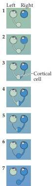
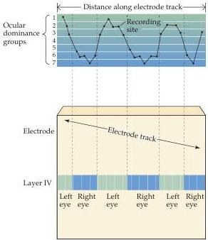

Central Visual Pathways

(A)

(B)
Figure 11.13 Columnar organization of ocular dominance.
(A) Cortical neurons in all layers vary in the strength of their response to the inputs from the two eyes, from complete domination by one eye to equal influence of the two eyes.
(B) Tangential electrode penetration across the superficial cortical layers reveals a gradual shift in the ocular dominance of the recorded neurons from one eye to the other.
In contrast, all neurons encountered in a vertical electrode penetration (other than those neurons that lie in layer IV) tend to have the same ocular dominance.

# Division of Labor within the Primary Visual Pathway

In addition to being specific for input from one eye or the other, the layers in the lateral geniculate are also distinguished on the basis of cell size: Two ventral layers are composed of large neurons and are referred to as the magnocellular layers, while more dorsal layers are composed of small neurons and are referred to as the parvocellular layers.
The magno- and parvocellular layers receive inputs from distinct populations of ganglion cells that exhibit corresponding differences in cell size.
M ganglion cells that terminate in the magnocellular layers have larger cell bodies, more extensive dendritic fields, and larger-diameter axons than the P ganglion cells that terminate in the parvocellular layers (Figure 11.14A).
Moreover, the axons of relay cells in the magno- and parvocellular layers of the lateral geniculate nucleus terminate on distinct populations of neurons located in separate strata within layer 4 of striate cortex.
Thus the retinogeniculate pathway is composed of parallel magnocellular and parvocellular streams that convey distinct types of information to the initial stages of cortical processing.

The response properties of the M and P ganglion cells provide important clues about the contributions of the magn- and parvocellular streams to visual perception.
M ganglion cells have larger receptive fields than P cells, and their axons have faster conduction velocities.
M and P ganglion cells also differ in ways that are not so obviously related to their morphology.
M cells respond transiently to the presentation of visual stimuli, while P cells respond in a sustained fashion.
Moreover, P ganglion cells can transmit information about color, whereas M cells cannot.
P cells convey color information because their receptive field centers and surrounds are driven by different classes of cones (i.e., cones responding with greatest sensitivity to