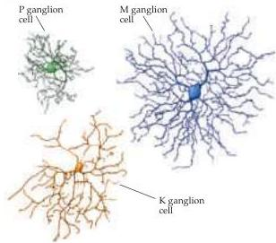
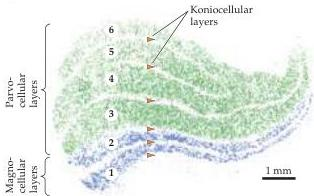

Chapter Eleven

# Box C

## Optical Imaging of Functional Domains in the Visual Cortex

The recent availability of optical imaging techniques has made it possible to visualize how response properties, such as the selectivity for edge orientation or ocular dominance, are mapped across the cortical surface.
These methods generally rely on intrinsic signals (changes in the amount of light reflected from the cortical surface) that correlate with levels of neural activity.
Such signals are thought to arise at least in part from local changes in the ratio of oxyhemoglobin and deoxyhemoglobin that accompany such activity, more active areas having a higher deoxyhemoglobin/oxyhemoglobin ratio (see also Box A in Chapter 1).
This change can be detected when the cortical surface is illuminated with red light (605–700 nm).
Under these conditions, active cortical regions absorb more light than less active ones.
With the use of a sensitive video camera, and averaging over a number of trials (the changes are small, 1 or 2 parts per thousand), it is possible to visualize these differences and use them to map cortical patterns of activity (Figure A).

This approach has now been successfully applied to both striate and extrastriate areas in both experimental animals and human patients undergoing neurosurgery.
The results emphasize that maps of stimulus features are a general principle of cortical organization.
For example, orientation preference is mapped in a continuous fashion such that adjacent positions on the cortical surface tend to have only slightly shifted orientation preferences.
However, there are points where continuity breaks down.
Around these points, orientation preference is represented in a radial pattern resembling a pinwheel, covering the whole 180° of possible orientation values (Figure B).

This powerful technique can also be used to determine how maps for different stimulus properties are arranged relative to one another, and to detect additional maps such as that for direction of motion.
A comparison of ocular dominance bands and orientation preference maps, for example, shows that pinwheel centers are generally located in the center of ocular dominance bands, and that the iso-orientation contours that emanate from the pinwheel centers run orthogonal to the borders of ocular dominance bands (Figure C).
An orderly relationship between maps of orientation selectivity and direction selectivity has also been demonstrated.
These systematic relationships between the functional maps that coexist within primary visual cortex are thought to ensure that all combinations of stimulus features (orientation, direction, ocular dominance, and spatial frequency) are analyzed for all regions of visual space.

## References

BLASDEL, G.
G.
AND G.
SALAMA (1986) Voltage-sensitive dyes reveal a modular organization in monkey striate cortex.
Nature 321: 579–585.
BONHOEFFER, T.
AND A.
GRINVALD (1993) The layout of iso-orientation domains in area 18 of the cat visual cortex: Optical imaging reveals a pinwheel-like organization.
J.
Neurosci 13: 4157–4180.
BONHOEFFER, T.
AND A.
GRINVALD (1996) Optical imaging based on intrinsic signals: The methodology.
In Brain Mapping: The Methods, A.
Toge (ed.).
New York: Academic Press.
OBERMAYER, K.
AND G.
G.
BLASDEL (1993) Geometry of orientation and ocular dominance columns in monkey striate cortex.
J.
Neurosci.
13: 4114–4129.
WELIKY, M., W.
H.
BOSKING AND D.
FITZPATRICK (1996) A systematic map of direction preference in primary visual cortex.
Nature 379: 725–728.

(A)

(B)