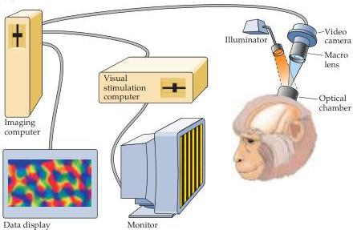
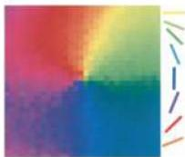
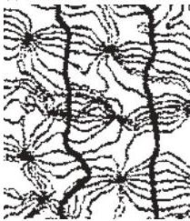

Central Visual Pathways 277

(A)

(A) The technique of optical imaging.
A sensitive video camera is used to record changes in light absorption that occur as the animal views various stimuli presented on a video monitor.
Images are digitized and stored in a computer in order to construct maps that compare patterns of activity associated with different stimuli.
(B) Maps of orientation preference in the visual cortex visualized with optical imaging.
Each color represents the angle of an edge that was most effective in activating the neurons at a given site.
Orientation preference changes in a continuous fashion, rotating around pinwheel centers.
(Note that this image shows only a small region of the overall map of orientation) (C) Comparison of optical image maps of orientation preference and ocular dominance in monkey visual cortex.
The thick black lines represent the borders between ocular dominance columns.
The thin gray lines represent the iso-orientation contours, which converge at orientation pinwheel centers (arrow).
Iso-orientation contour lines generally intersect the borders of ocular dominance bands at right angles.
(B from Bonhoeffer and Grinvald, 1993; C from Obermeyer and Blasdel, 1993.)

(B)

(C)

short-, medium-, or long-wavelength light).
For example, some P ganglion cells have centers that receive inputs from long-wavelength ("red") sensitive cones and surrounds that receive inputs from medium-wavelength ("green") cones.
Others have centers that receive inputs from "green cones" and surrounds from "red cones" (see Chapter 10).
As a result, P cells are sensitive to differences in the wavelengths of light striking their receptive field center

$\triangleleft$ Figure 11.14 Magno- and parvocellular streams.
(A) Tracings of M and P ganglion cells as seen in flat mounts of the retina after staining by the Golgi method.
M cells have large-diameter cell bodies and large dendritic fields.
They supply the magnocellular layers of the lateral geniculate nucleus.
P cells have smaller cell bodies and dendritic fields.
They supply the parvocellular layers of the lateral geniculate nucleus.
(B) Photomicrograph of the human lateral geniculate nucleus showing the magnocellular and parvocellular layers.
(A after Watanabe and Rodieck, 1989; B courtesy of T.
Andrews and D.
Purves.)