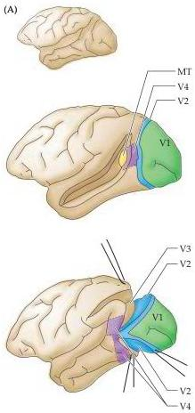
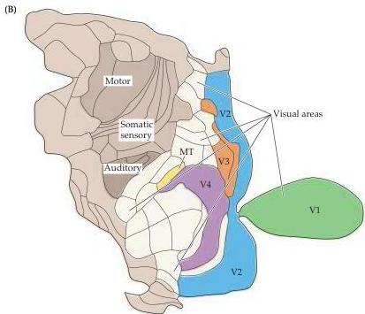

Central Visual Pathways 279

sentations of the visual field (Figure 11.16).
One of these areas exhibits a large motion-selective signal, suggesting that it is the homologue of the motion-selective middle temporal area described in monkeys.
Another area exhibits color-selective responses, suggesting that it may be similar to V4 in non-human primates.
A role for these areas in the perception of motion and color, respectively, is further supported by evidence for increases in activity not only during the presentation of the relevant stimulus, but also during periods when subjects experience motion or color afterimages.

The clinical description of selective visual deficits after localized damage to various regions of extrastriate cortex also supports functional specialization of extrastriate visual areas in humans.
For example, a well-studied patient who suffered a stroke that damaged the extrastriate region thought to be comparable to area MT in the monkey was unable to appreciate the motion of objects.
The neurologist who treated her noted that she had difficulty in pouring tea into a cup because the fluid seemed to be "frozen." In addition, she could not stop pouring at the right time because she was unable to perceive when the fluid level had risen to the brim.
The patient also had trouble following a dialogue because she could not follow the movements of the speaker's mouth.
Crossing the street was potentially terrifying because she couldn't judge the movement of approaching cars.
As the patient related, "When I'm looking at the car first, it seems far away.
But

Figure 11.15 Subdivisions of the extrastriate cortex in the macaque monkey.
(A) Each of the subdivisions indicated in color contains neurons that respond to visual stimulation.
Many are buried in sulci, and the overlying cortex must be removed in order to expose them.
Some of the more extensively studied extrastriate areas are specifically identified (V2, V3, V4, and MT).
V1 is the primary visual cortex; MT is the middle temporal area.
(B) The arrangement of extrastriate and other areas of neocortex in a flattened view of the monkey neocortex.
There are at least 25 areas that are predominantly or exclusively visual in function, plus 7 other areas suspected to play a role in visual processing.
(A after Maunsell and Newsome, 1987; B after Felleman and Van Essen, 1991.)