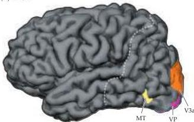
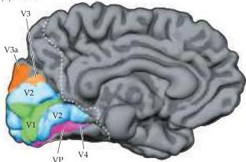
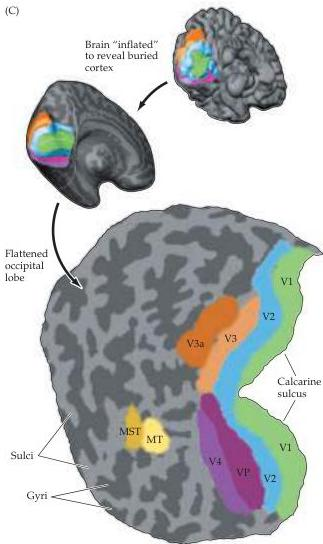

Chapter Eleven

(A) Lateral

(B) Medial
Figure 11.16 Localization of multiple visual areas in the human brain using fMRI.
(A,B) Lateral and medial views (respectively) of the human brain, illustrating the location of primary visual cortex (V1) and additional visual areas V2, V3, VP (ventral posterior area), V4, MT (middle temporal area), and MST (medial superior temporal area).
(C) Unfolded and flattened view of retinotopically defined visual areas in the occipital lobe.
Dark grey areas correspond to cortical regions that were buried in sulci; light regions correspond to regions that were located on the surface of gyri.
Visual areas in humans show a close resemblance to visual areas originally defined in monkeys (compare with Figure 11.15).
(After Sereno et al., 1995.)

(C)

then, when I want to cross the road, suddenly the car is very near." Her ability to perceive other features of the visual scene, such as color and form, was intact.

Another example of a specific visual deficit as a result of damage to extrastriate cortex is cerebral achromatopsia.
These patients lose the ability to see the world in color, although other aspects of vision remain in good working order.
The normal colors of a visual scene are described as being replaced by "dirty" shades of gray, much like looking at a poor quality black-and-white movie.
Achromatopsic individuals know the normal colors of objects—that a school bus is yellow, an apple red—but can no longer see them.
Thus, when asked to draw objects from memory, they have no difficulty with shapes but are unable to appropriately color the objects they have represented.
It is important to distinguish this condition from the color blindness that arises from the congenital absence of one or more cone pigments in the retina (see Chapter 10).
In achromatopsia, the three types of cones are functioning normally; it is damage to specific extrastriate cortical areas that renders the patient unable to use the information supplied by the retina.