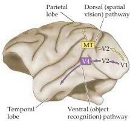

Central Visual Pathways 281

Based on the anatomical connections between visual areas, differences in electrophysiological response properties, and the effects of cortical lesions, a consensus has emerged that extrastriate cortical areas are organized into two largely separate systems that eventually feed information into cortical association areas in the temporal and parietal lobes (see Chapter 25).
One system, called the ventral stream, includes area V4 and leads from the striate cortex into the inferior part of the temporal lobe.
This system is thought to be responsible for high-resolution form vision and object recognition.
The dorsal stream, which includes the middle temporal area, leads from striate cortex into the parietal lobe.
This system is thought to be responsible for spatial aspects of vision, such as the analysis of motion, and positional relationships between objects in the visual scene (Figure 11.17).

The functional dichotomy between these two streams is supported by observations on the response properties of neurons and the effects of selective cortical lesions.
Neurons in the ventral stream exhibit properties that are important for object recognition, such as selectivity for shape, color, and texture.
At the highest levels in this pathway, neurons exhibit even greater selectivity, responding preferentially to faces and objects (see Chapter 25).
In contrast, those in the dorsal stream are not tuned to these properties, but show selectivity for direction and speed of movement.
Consistent with this interpretation, lesions of the parietal cortex severely impair an animal's ability to distinguish objects on the basis of their position, while having little effect on its ability to perform object recognition tasks.
In contrast, lesions of the inferotemporal cortex produce profound impairments in the ability to perform recognition tasks but no impairment in spatial tasks.
These effects are remarkably similar to the syndromes associated with damage to the parietal and temporal lobe in humans (see Chapters 25 and 26).

What, then, is the relationship between these "higher-order" extrastriate visual pathways and the magno- and parvocellular pathways that supply the primary visual cortex? Not long ago, it seemed that these intracortical pathways were simply a continuation of the geniculostriate pathways—that is, the magnocellular pathway provided input to the dorsal stream and the parvocellular pathway provided input to the ventral stream.
However, more recent work has indicated that the situation is more complicated.
The temporal pathway clearly has access to the information conveyed by both the magno- and parvocellular streams; and the parietal pathway, while dominated by inputs from the magnocellular stream, also receives inputs from the parvocellular stream.
Thus, interaction and cooperation between the magno- and parvocellular streams appear to be the rule in complex visual perceptions.

## Summary

Distinct populations of retinal ganglion cells send their axons to a number of central visual structures that serve different functions.
The most important projections are to the pretectum for mediating the pupillary light reflex, to the hypothalamus for the regulation of circadian rhythms, to the superior colliculus for the regulation of eye and head movements, and—most important of all—to the lateral geniculate nucleus for mediating vision and visual perception.
The retinogeniculostriate projection (the primary visual pathway) is arranged topographically such that central visual structures contain an organized map of the contralateral visual field.
Damage anywhere along the primary visual pathway, which includes the optic nerve, optic tract, lateral geniculate nucleus, optic radiation, and striate cortex, results in a loss of vision confined to a predictable region of visual space.
Compared to retinal

Figure 11.17 The visual areas beyond the striate cortex are broadly organized into two pathways: a ventral pathway that leads to the temporal lobe, and a dorsal pathway that leads to the parietal lobe.
The ventral pathway plays an important role in object recognition, the dorsal pathway in spatial vision.