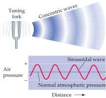
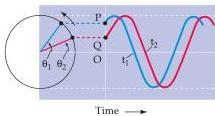

Chapter Twelve

Figure 12.1 Diagram of the periodic condensation and rarefaction of air molecules produced by the vibrating tines of a tuning fork.
The molecular disturbance of the air is pictured as if frozen at the instant the constituent molecules responded to the resultant pressure wave.
Shown below is a plot of the air pressure versus distance from the fork.
Note its sinusoidal quality.

Figure 12.2 A sine wave and its projection as circular motion.
The two sinusoids shown are at different phases, such that point P corresponds to phase angle  $\theta_{1}$  and point Q corresponds to phase angle  $\theta_{2}$ .

Figure 12.1 diagrams the behavior of air molecules near a tuning fork that vibrates sinusoidally when struck.
The vibrating tines of the tuning fork produce local displacements of the surrounding molecules, such that when the tine moves in one direction, there is molecular condensation; when it moves in the other direction, there is rarefaction.
These changes in density of the air molecules are equivalent to local changes in air pressure.

Such regular, sinusoidal cycles of compression and rarefaction can be thought of as a form of circular motion, with one complete cycle equivalent to one full revolution  $(360^{\circ})$ .
This point can be illustrated with two sinusoids of the same frequency projected onto a circle, a strategy that also makes it easier to understand the concept of phase (Figure 12.2).
Imagine that two tuning forks, both of which resonate at the same frequency, are struck at slightly different times.
At a given time  $t = 0$ , one wave is at position P and the other at position Q.
By projecting P and Q onto the circle, their respective phase angles,  $\theta_{1}$  and  $\theta_{2}$ , are apparent.
The sine wave that starts at P reaches a particular point on the circle, say  $180^{\circ}$ , at time  $t_{1}$ , whereas the wave that starts at Q reaches  $180^{\circ}$  at time  $t_{2}$ .
Thus, phase differences have corresponding time differences, a concept that is important in appreciating how the auditory system locates sounds in space.

The human ear is extraordinarily sensitive to sound pressure.
At the threshold of hearing, air molecules are displaced an average of only 10 picometers  $(10^{-11}\mathrm{m})$ , and the intensity of such a sound is about one-trillionth of a watt per square meter! This means a listener on an otherwise noiseless planet could hear a 1-watt,  $3\mathrm{-kHz}$  sound source located over  $450~\mathrm{km}$  away (consider that even a very dim light bulb consumes more than 1 watt of power).
Even dangerously high sound pressure levels  $(&gt;100\mathrm{dB})$  have power at the eardrum that is only in the milliwatt range (Box A).

# The Audible Spectrum

Humans can detect sounds in a frequency range from about  $20\mathrm{Hz}$  to  $20\mathrm{kHz}$ .
Human infants can actually hear frequencies slightly higher than  $20\mathrm{kHz}$ , but lose some high-frequency sensitivity as they mature; the upper limit in average adults is closer to  $15 - 17\mathrm{kHz}$ .
Not all mammalian species are sensitive to the same range of frequencies.
Most small mammals are sensitive to very high frequencies, but not to low frequencies.
For instance, some species of bats are sensitive to tones as high as  $200\mathrm{kHz}$ , but their lower limit is around  $20\mathrm{kHz}$ —the upper limit for young people with normal hearing.

One reason for these differences is that small objects, including the auditory structures of these small mammals, resonate at high frequencies, whereas large objects tend to resonate at low frequencies—which explains why the violin has a higher pitch than the cello.
Different animal species tend to emphasize frequency bandwidths in both their vocalizations and their range of hearing.
In general, vocalizations by virtue of their periodicity can be distinguished from the noise "barrier" created by environmental sounds, such as wind and rustling leaves.
Animals that echolocate, such as bats and dolphins, rely on very high-frequency vocal sounds to maximally resolve spatial features of the target, while animals intent on avoiding predation have auditory systems "tuned" to the low frequency vibrations that approaching predators transmit through the substrate.
These behavioral differences are mirrored by a wealth of anatomical and functional specializations throughout the auditory system.