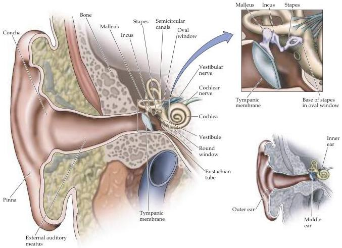

Chapter Twelve

Figure 12.3 The human ear.
Note the large surface area of the tympanic membrane (eardrum) relative to the oval window, a feature that facilitates transmission of airborne sounds to the fluid-filled cochlea.

generated by heavy machinery or high explosives (see Box A).
The sensitivity to this frequency range in the human auditory system appears to be directly related to speech perception: although human speech is a broadband signal, the energy of the plosive consonants (e.g., ba and pa) that distinguish different phonemes (the elementary human speech sounds) is concentrated around  $3\mathrm{kHz}$  (see Box A in Chapter 26).
Therefore, selective hearing loss in the  $2 - 5\mathrm{kHz}$  range disproportionately degrades speech recognition.
Most vocal communication occurs in the low-kHz range to overcome environmental noise; as already noted, generation of higher frequencies is difficult for animals the size of humans.

A second important function of the pinna and concha is to selectively filter different sound frequencies in order to provide cues about the elevation of the sound source.
The vertically asymmetrical convolutions of the pinna are shaped so that the external ear transmits more high-frequency components from an elevated source than from the same source at ear level.
This effect can be demonstrated by recording sounds from different elevations after they have passed through an "artificial" external ear; when the recorded sounds are played back via earphones, so that the whole series is at the same elevation relative to the listener, the recordings from higher elevations are perceived as coming from positions higher in space than the recordings from lower elevations.