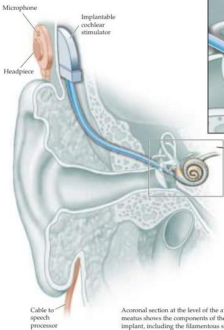
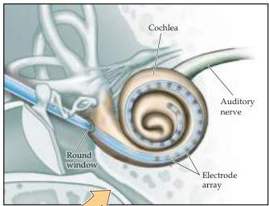

The Auditory System 291

Cable to speech processor
Acoronal section at the level of the auditory meatus shows the components of the cochlear implant, including the filamentous stimulatory electrode inserted into the cochlea through the round window.

learned to speak, whether cochlear implants can enable development of spoken language in the congenitally deaf is still a matter of debate.
Although cochlear implants cannot help patients with VIIIth nerve damage, brainstem implants are being developed that use a conceptually similar approach to stimulate the cochlear nuclei directly, bypassing the auditory periphery altogether.

## References

RAMSDEN, R.
T.
(2002) Cochlear implants and brain stem implants.
Brit.
Med.
Bull.
63: 183–193.

RAUSCHECKER, J.
P.
AND R.
V.
SHANNON (2002) Sending sound to the brain.
Science.
295: 1025–1029.

cochlear partition.
The cochlear partition does not extend all the way to the apical end of the cochlea; instead there is an opening, known as the heli-cotrema, that joins the scala vestibuli to the scala tympani, allowing their fluid, known as perilymph, to mix.
One consequence of this structural arrangement is that inward movement of the oval window displaces the fluid of the inner ear, causing the round window to bulge out slightly and deforming the cochlear partition.

The manner in which the basilar membrane vibrates in response to sound is the key to understanding cochlear function.
Measurements of the vibra