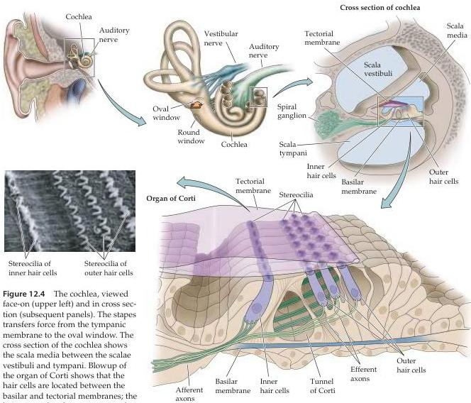

Chapter Twelve

tion of different parts of the basilar membrane, as well as the discharge rates of individual auditory nerve fibers that terminate along its length, show that both these features are highly tuned; that is, they respond most intensely to a sound of a specific frequency.
Frequency tuning within the inner ear is attributable in part to the geometry of the basilar membrane, which is wider and more flexible at the apical end and narrower and stiffer at the basal end.
One feature of such a system is that regardless of where energy is supplied to it, movement always begins at the stiff end (i.e., the base), and then propagates to the more flexible end (i.e., the apex).
Georg von Békésy, working at Harvard University, showed that a membrane that varies systematically in its width and flexibility vibrates maximally at different positions as a function of the stimulus frequency (Figure 12.5).
Using tubular models and human cochleas taken from cadavers, he found that an acoustical stimulus initiates a traveling wave of the same frequency in the cochlea, which propagates from the base toward the apex of the basilar membrane, growing in

