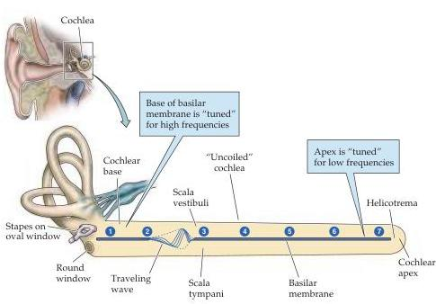
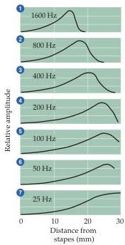

The Auditory System 293

Figure 12.5 Traveling waves along the cochlea.
A traveling wave is shown at a given instant along the cochlea, which has been uncoiled for clarity.
The graphs on the right profile the amplitude of the traveling wave along the basilar membrane for different frequencies and show that the position (i.e., 1–7) where the traveling wave reaches its maximum amplitude varies directly with the frequency of stimulation.
(Drawing after Dallos, 1992; graphs after von Békésy, 1960.)

amplitude and slowing in velocity until a point of maximum displacement is reached.
This point of maximal displacement is determined by the sound frequency.
The points responding to high frequencies are at the base of the basilar membrane where it is stiffer, and the points responding to low frequencies are at the apex, giving rise to a topographical mapping of frequency (that is, to tonotopy).
An important feature is that complex sounds cause a pattern of vibration equivalent to the superposition of the vibrations generated by the individual tones making up that complex sound, thus accounting for the decompositional aspects of cochlear function mentioned earlier.
This process of spectral decomposition appears to be an important strategy for detecting the various harmonic combinations that distinguish different natural sounds.
Indeed, tonotopy is conserved throughout much of the auditory system, including the auditory cortex, suggesting that it is important to speech processing.

Von Békésy’s model of cochlear mechanics was a passive one, resting on the premise that the basilar membrane acts like a series of linked resonators, much as a concatenated set of tuning forks.
Each point on the basilar membrane was postulated to have a characteristic frequency at which it vibrated most efficiently; because it was physically linked to adjacent areas of the membrane, each point also vibrated (if somewhat less readily) at other frequencies, thus permitting propagation of the traveling wave.
It is now clear, however, that the tuning of the auditory periphery, whether measured at the basilar membrane or recorded as the electrical activity of auditory nerve fibers, is too sharp to be explained by passive mechanics alone.
At very low sound intensities, the basilar membrane vibrates one hundred-fold more than would be predicted by linear extrapolation from the motion measured at high intensities.
Therefore, the ear’s sensitivity arises from an active biomechanical process, as well as from its passive resonant properties (Box D).
The outer hair cells, which together with the inner hair cells comprise the