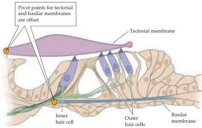
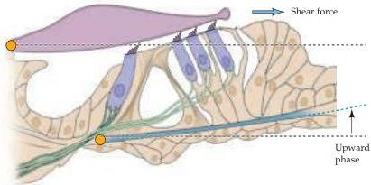
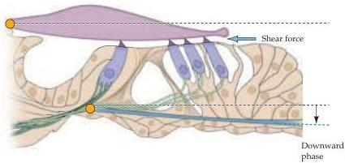

The Auditory System

(A) Resting position

(B) Sound-induced vibration

Figure 12.6 Movement of the basilar membrane creates a shearing force that bends the stereocilia of the hair cells.
The pivot point of the basilar membrane is offset from the pivot point of the tectorial membrane, so that when the basilar membrane is displaced, the tectorial membrane moves across the tops of the hair cells, bending the stereocilia.