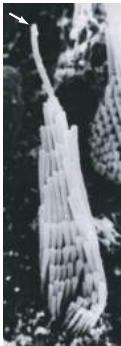
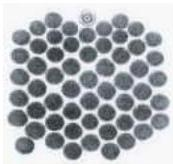
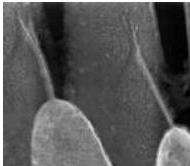
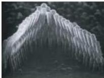

Chapter Twelve

(A)

(B)

(D)

(C)
Figure 12.7  The structure and function of the hair bundle in vestibular and cochlear hair cells .
The vestibular hair bundles shown here resemble those of cochlear hair cells, except for the presence of the kinocilium, which disappears in the mammalian cochlea shortly after birth.
(A) The hair bundle of a guinea pig vestibular hair cell.
This view shows the increasing height leading to the kinocilium (arrow).
(B) Cross section through the vestibular hair bundle shows the $9 + 2$ array of microtubules in the kinocilium (top), which contrasts with the simpler actin filament structure of the stereocilia.
(C) Scanning electron micrograph of a guinea pig cochlear outer hair cell bundle viewed along the plane of mirror symmetry.
Note the graded lengths of the stereocilia, and the absence of a kinocilium.
(D) Tip links that connect adjacent stereocilia are believed to be the mechanical linkage that opens and closes the transduction channel.
(A from Lindeman, 1973; B from Hudspeth, 1983; C from Pickles, 1988; D from Fain, 2003.)

hair cell operates is truly amazing: At the limits of human hearing, hair cells can faithfully detect movements of atomic dimensions and respond in the tens of microseconds! Furthermore, hair cells can adapt rapidly to constant stimuli, thus allowing the listener to extract signals from a noisy background.

The hair cell is a flask-shaped epithelial cell named for the bundle of hairlike processes that protrude from its apical end into the scala media.
Each hair bundle contains anywhere from 30 to a few hundred hexagonally arranged stereocilia, with one taller kinocilium (Figure 12.7A).
Despite their names, only the kinocilium is a true ciliary structure, with the characteristic two central tubules surrounded by nine doublet tubules that define cilia (Figure 12.7B).
The function of the kinocilium is unclear, and in the cochlea of humans and other mammals it actually disappears shortly after birth (Figure 12.7C).
The stereocilia are simpler, containing only an actin cytoskeleton.
Each stereocilium tapers where it inserts into the apical membrane, forming a hinge about which each stereocilium pivots (Figure 12.7D).
The stereocilia are graded in height and are arranged in a bilaterally symmetric fashion (in vestibular hair cells, this plane runs through the kinocilium).
Displacement of the hair bundle parallel to this plane toward the tallest stereocilia depolarizes the hair cell, while movements parallel to this plane toward the shortest stereocilia cause hyperpolarization.
In contrast, displacements perpendicular to the plane of symmetry do not alter the hair cell's membrane potential.
The hair bundle movements at the threshold of hearing are approximately $0.3\mathrm{nm}$ about the diameter of an atom of gold.
Hair cells can convert the displacement of the stereociliary bundle into an electrical potential in as little as 10 microseconds; as described below, such speed is required for the accurate localization of the source of the sound.
The need for microsecond resolution places certain constraints on the transduction mechanism, ruling out the rela
