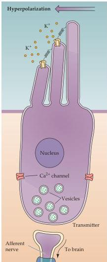
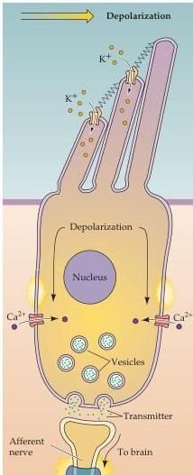

The Auditory System 297

tively slow second messenger pathways used in visual and olfactory transduction (see Chapters 7, 10, and 14); a direct, mechanically gated transduction channel is needed to operate this quickly.
Evidently the filamentous structures that connect the tips of adjacent stereocilia, known as tip links, directly open cation-selective transduction channels when stretched, allowing K⁺ ions to flow into the cell (see Figure 12.7D).
As the linked stereocilia pivot from side to side, the tension on the tip link varies, modulating the ionic flow and resulting in a graded receptor potential that follows the movements of the stereocilia (Figures 12.8 and 12.9).
The tip link model also explains why only deflections along the axis of the hair bundle activate transduction channels, since tip links join adjacent stereocilia along the axis directed toward the tallest stereocilia (see also Box B in Chapter 13).
The exquisite mechanical sensitivity of the stereocilia also presents substantial risks: high intensity sounds can shear off the hair bundle, resulting in profound hearing deficits.
Because human stereocilia, unlike those in fishes and birds, do not regenerate such damage is irreversible.
The small number of hair cells (a total of about 30,000 in a human, or 15,000 per ear) further compounds the sensitivity of the inner

(A)

(B)
Figure 12.8 Mechanoelectrical transduction mediated by hair cells.
(A,B) When the hair bundle is deflected toward the tallest stereocilium, cation-selective channels open near the tips of the stereocilia, allowing K⁺ ions to flow into the hair cell down their electrochemical gradient (see text on next page for the explanation of this peculiar situation).
The resulting depolarization of the hair cell opens voltage-gated Ca²⁺ channels in the cell soma, allowing calcium entry and release of neurotransmitter onto the nerve endings of the auditory nerve.
(After Lewis and Hudspeth, 1983)