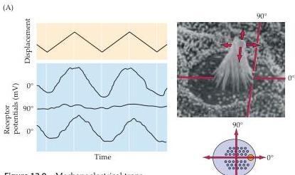
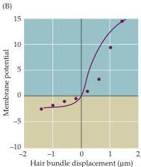
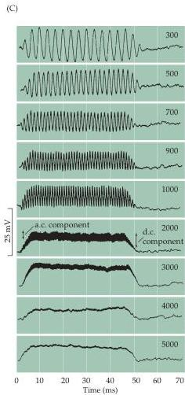

Chapter Twelve

Figure 12.9 Mechanoelectrical transduction mediated by vestibular hair cells.
(A) Vestibular hair cell receptor potentials (bottom three traces; blue) measured in response to symmetrical displacement (top trace; yellow) of the hair bundle about the resting position, either parallel  $(0^{\circ})$  or orthogonal  $(90^{\circ})$  to the plane of bilateral symmetry.
(B) The asymmetrical stimulus/response ( $x$ -axis/ $y$ -axis) function of the hair cell.
Equivalent displacements of the hair bundle generate larger depolarizing responses than hyperpolarizing responses because most transduction channels are closed "at rest" (i.e.,  $0\mu \mathrm{m}$ ).
(C) Receptor potentials generated by an individual hair cell in the cochlea in response to pure tones (indicated in Hz, right).
Note that the hair cell potential faithfully follows the waveform of the stimulating sinusoids for low frequencies  $(&lt;3\mathrm{kHz})$ , but still responds with a DC offset to higher frequencies.
(A after Shotwell et al., 1981; B after Hudspeth and Corey, 1977; C after Palmer and Russell, 1986.)

ear to environmental and genetic insults.
An important goal of current research is to identify the stem cells and factors that could contribute to the regeneration of human hair cells, thus affording a possible therapy for some forms of sensorineural hearing loss.

Understanding the ionic basis of hair cell transduction has been greatly advanced by intracellular recordings made from these tiny structures.
The hair cell has a resting potential between  $-45$  and  $-60\mathrm{mV}$  relative to the fluid that bathes the basal end of the cell.
At the resting potential, only a small fraction of the transduction channels are open.
When the hair bundle is displaced in the direction of the tallest stereocilium, more transduction channels open, causing depolarization as  $\mathbf{K}^+$  enters the cell.
Depolarization in turn opens voltage-gated calcium channels in the hair cell membrane, and the resultant  $\mathrm{Ca^{2 + }}$  influx causes transmitter release from the basal end of the cell onto the auditory nerve endings (Figure 12.8A,B).
Such calcium-dependent exocytosis is similar to chemical neurotransmission elsewhere in the central and peripheral nervous system (see Chapters 5 and 6); thus the hair cell has become a useful model for studying calcium-dependent transmitter release.
Because some transduction channels are open at rest, the receptor potential is biphasic: Movement toward the tallest stereocilia depolarizes the cell, while move