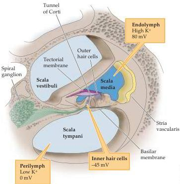

The Auditory System 299

ment in the opposite direction leads to hyperpolarization.
This situation allows the hair cell to generate a sinusoidal receptor potential in response to a sinusoidal stimulus, thus preserving the temporal information present in the original signal up to frequencies of around $3\mathrm{kHz}$ (Figure 12.9).
Hair cells still can signal at frequencies above $3\mathrm{kHz}$, although without preserving the exact temporal structure of the stimulus: the asymmetric displacement-receptor current function of the hair cell bundle is filtered by the cell's membrane time constant to produce a tonic depolarization of the soma, augmenting transmitter release and thus exciting VIIIth nerve terminals.

The high-speed demands of mechanoelectrical transduction have resulted in some impressive ionic specializations within the inner ear.
An unusual adaptation of the hair cell in this regard is that $\mathrm{K}^+$ serves both to depolarize and repolarize the cell, enabling the hair cell's $\mathrm{K}^+$ gradient to be largely maintained by passive ion movement alone.
As with other epithelial cells, the basal and apical surfaces of the hair cell are separated by tight junctions, allowing separate extracellular ionic environments at these two surfaces.
The apical end (including the stereocilia) protrudes into the scala media and is exposed to the $\mathrm{K}^+$-rich, $\mathrm{Na}^+$-poor endolymph, which is produced by dedicated ion pumping cells in the stria vascularis (Figure 12.10).
The basal end of the hair cell body is bathed in the same fluid that fills the scala tympani, the perilymph, which resembles other extracellular fluids in that it is $\mathrm{K}^+$-poor and $\mathrm{Na}^+$-rich.
In addition, the compartment containing endolymph is about $80\mathrm{mV}$ more positive than the perilymph compartment (this difference is known as the endocochlear potential), while the inside of the hair cell is about $45\mathrm{mV}$ more negative than the perilymph (and $125\mathrm{mV}$ more negative than the endolymph).
The resulting electrical gradient across the membrane of the stereocilia (about $125\mathrm{mV}$; the difference between the hair cell resting potential and the endocochlear potential) drives $\mathrm{K}^+$ through open transduc

Figure 12.10 The stereocilia of the hair cells protrude into the endolymph, which is high in $\mathbf{K}^{+}$ and has an electrical potential of $+80\mathrm{mV}$ relative to the perilymph.