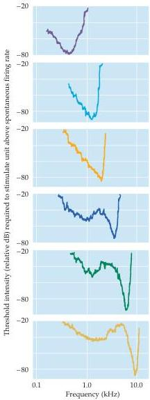
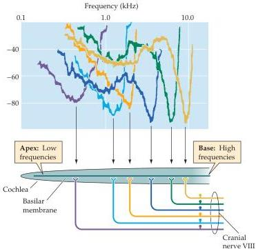
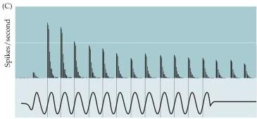

Chapter Twelve

(A)

(B)

Figure 12.11 Response properties of auditory nerve fibers.
(A) Frequency tuning curves of six different fibers in the auditory nerve.
Each graph plots, across all frequencies to which the fiber responds, the minimum sound level required to increase the fiber's firing rate above its spontaneous firing level.
The lowest point in the plot is the weakest sound intensity to which the neuron will respond.
The frequency at this point is called the neuron's characteristic frequency.
(B) The frequency tuning curves of auditory nerve fibers superimposed and aligned with their approximate relative points of innervation along the basilar membrane.
(In the side view schematic, the basilar membrane is represented as a black line within the unrolled cochlea.) (C) Temporal response patterns of a low-frequency axon in the auditory nerve.
The stimulus waveform is indicated beneath the histograms, which show the phase-locked responses to a 50-ms tone pulse of  $260\mathrm{Hz}$ .
Note that the spikes are all timed to the same phase of the sinusoidal stimulus.
(A after Kiang and Moxon, 1972; C after Kiang, 1984.)